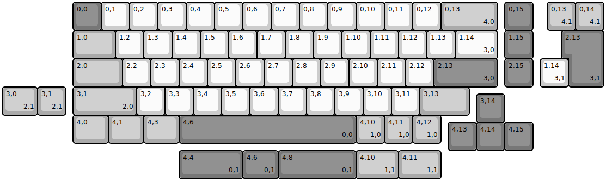
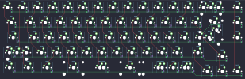

## boardsource/the_mark_65

[layout](the_mark_65-kle.json) - [PCB](the_mark_65.kicad_pcb)

{:loading="lazy"}

[Open in keyboard-layout-editor](http://www.keyboard-layout-editor.com/##@@_x:2.5&c=#777777;&=0,0&_c=#cccccc;&=0,1&=0,2&=0,3&=0,4&=0,5&=0,6&=0,7&=0,8&=0,9&=0,10&=0,11&=0,12&_c=#aaaaaaaa&w:2;&=0,13%0A%0A%0A4,0&_x:0.25&c=#777777;&=0,15;&@_x:2.5&c=#aaaaaaaa&w:1.5;&=1,0&_c=#cccccc;&=1,2&=1,3&=1,4&=1,5&=1,6&=1,7&=1,8&=1,9&=1,10&=1,11&=1,12&=1,13&_w:1.5;&=1,14%0A%0A%0A3,0&_x:0.25&c=#777777;&=1,15;&@_x:2.5&c=#aaaaaaaa&w:1.75;&=2,0&_c=#cccccc;&=2,2&=2,3&=2,4&=2,5&=2,6&=2,7&=2,8&=2,9&=2,10&=2,11&=2,12&_c=#777777&w:2.25;&=2,13%0A%0A%0A3,0&_x:0.25;&=2,15;&@_x:2.5&c=#aaaaaaaa&w:2.25;&=3,1%0A%0A%0A2,0&_c=#cccccc;&=3,2&=3,3&=3,4&=3,5&=3,6&=3,7&=3,8&=3,9&=3,10&=3,11&_c=#aaaaaaaa&w:1.75;&=3,13;&@_x:16.75&y:-0.75&c=#777777;&=3,14;&@_x:2.5&y:-0.25&c=#aaaaaaaa&w:1.25;&=4,0&_w:1.25;&=4,1&_w:1.25;&=4,3&_c=#777777&w:6.25;&=4,6%0A%0A%0A0,0&_c=#aaaaaaaa;&=4,10%0A%0A%0A1,0&=4,11%0A%0A%0A1,0&=4,12%0A%0A%0A1,0;&@_x:15.75&y:-0.75&c=#777777;&=4,13&=4,14&=4,15;&@_x:19.25&y:-5.25&c=#aaaaaaaa;&=0,13%0A%0A%0A4,1&=0,14%0A%0A%0A4,1;&@_x:20.0&c=#777777&w:1.25&h:2&w2:1.5&h2:1&x2:-0.25;&=2,13%0A%0A%0A3,1;&@_x:19.0&c=#cccccc;&=1,14%0A%0A%0A3,1;&@_c=#aaaaaaaa&w:1.25;&=3,0%0A%0A%0A2,1&=3,1%0A%0A%0A2,1;&@_x:6.25&y:1.25&c=#777777&w:2.25;&=4,4%0A%0A%0A0,1&_w:1.25;&=4,6%0A%0A%0A0,1&_w:2.75;&=4,8%0A%0A%0A0,1&_c=#aaaaaaaa&w:1.5;&=4,10%0A%0A%0A1,1&_w:1.5;&=4,11%0A%0A%0A1,1)

{:loading="lazy"}

