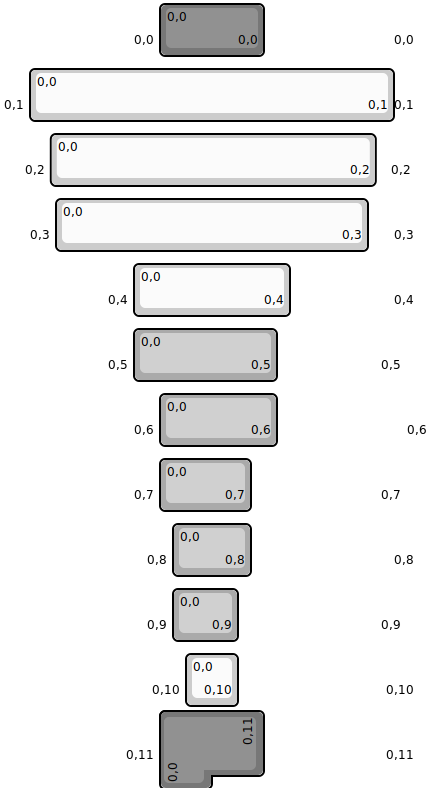

## botanicalkeyboards/fm2u

[layout](fm2u-kle.json) - [PCB](fm2u.kicad_pcb)

{:loading="lazy"}

[Open in keyboard-layout-editor](http://www.keyboard-layout-editor.com/##@@_c=#777777&w:3&d:true;&=%0A%0A%0A0,0&_w:2;&=0,0%0A%0A%0A0,0&_w:3&d:true;&=%0A%0A%0A0,0;&@_y:0.25&c=#cccccc&w:0.5&d:true;&=%0A%0A%0A0,1&_w:7;&=0,0%0A%0A%0A0,1&_w:0.5&d:true;&=%0A%0A%0A0,1;&@_y:0.25&w:0.9&d:true;&=%0A%0A%0A0,2&_w:6.25;&=0,0%0A%0A%0A0,2&_w:0.8&d:true;&=%0A%0A%0A0,2;&@_y:0.25&d:true;&=%0A%0A%0A0,3&_w:6;&=0,0%0A%0A%0A0,3&_d:true;&=%0A%0A%0A0,3;&@_y:0.25&w:2.5&d:true;&=%0A%0A%0A0,4&_w:3;&=0,0%0A%0A%0A0,4&_w:2.5&d:true;&=%0A%0A%0A0,4;&@_y:0.25&w:2.5&d:true;&=%0A%0A%0A0,5&_c=#aaaaaa&w:2.75;&=0,0%0A%0A%0A0,5&_c=#cccccc&w:2.5&d:true;&=%0A%0A%0A0,5;&@_y:0.25&w:3&d:true;&=%0A%0A%0A0,6&_c=#aaaaaa&w:2.25;&=0,0%0A%0A%0A0,6&_c=#cccccc&w:3&d:true;&=%0A%0A%0A0,6;&@_y:0.25&w:3&d:true;&=%0A%0A%0A0,7&_c=#aaaaaa&w:1.75;&=0,0%0A%0A%0A0,7&_c=#cccccc&w:3&d:true;&=%0A%0A%0A0,7;&@_y:0.25&w:3.25&d:true;&=%0A%0A%0A0,8&_c=#aaaaaa&w:1.5;&=0,0%0A%0A%0A0,8&_c=#cccccc&w:3.25&d:true;&=%0A%0A%0A0,8;&@_y:0.25&w:3.25&d:true;&=%0A%0A%0A0,9&_c=#aaaaaa&w:1.25;&=0,0%0A%0A%0A0,9&_c=#cccccc&w:3.25&d:true;&=%0A%0A%0A0,9;&@_y:0.25&w:3.5&d:true;&=%0A%0A%0A0,10&=0,0%0A%0A%0A0,10&_w:3.5&d:true;&=%0A%0A%0A0,10;&@_y:0.25&c=#777777&w:3&d:true;&=%0A%0A%0A0,11&_x:2&c=#cccccc&w:3&d:true;&=%0A%0A%0A0,11;&@_r:-90&x:-15&y:-11.75&c=#777777&w:1.25&h:2&w2:1.5&h2:1&x2:-0.25;&=0,0%0A%0A%0A0,11)

{:loading="lazy"}

