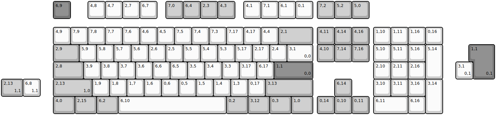
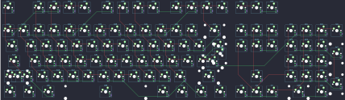

## bpiphany/tiger_lily

[layout](tiger_lily-kle.json) - [PCB](tiger_lily.kicad_pcb)

{:loading="lazy"}

[Open in keyboard-layout-editor](http://www.keyboard-layout-editor.com/##@@_x:3&c=#777777;&=6,9&_x:1&c=#cccccc;&=4,8&=4,7&=2,7&=6,7&_x:0.5&c=#aaaaaa;&=7,0&=6,4&=2,3&=4,3&_x:0.5&c=#cccccc;&=4,1&=7,1&=6,1&=0,1&_x:0.25&c=#aaaaaa;&=7,2&=5,2&=5,0;&@_x:3&y:0.5&c=#cccccc;&=4,9&=7,9&=7,8&=7,7&=7,6&=4,6&=4,5&=7,5&=7,4&=7,3&=7,17&=4,17&=4,4&_c=#aaaaaa&w:2;&=2,1&_x:0.25;&=4,11&=4,14&=4,16&_x:0.25&c=#cccccc;&=1,10&=1,11&=1,16&=0,16;&@_x:3&c=#aaaaaa&w:1.5;&=2,9&_c=#cccccc;&=5,9&=5,8&=5,7&=5,6&=2,6&=2,5&=5,5&=5,4&=5,3&=5,17&=2,17&=2,4&_w:1.5;&=3,1%0A%0A%0A0,0&_x:0.25&c=#aaaaaa;&=4,10&=7,14&=7,16&_x:0.25&c=#cccccc;&=5,10&=5,11&=5,16&_h:2;&=5,14;&@_x:3&c=#aaaaaa&w:1.75;&=2,8&_c=#cccccc;&=3,9&=3,8&=3,7&=3,6&=6,6&=6,5&=3,5&=3,4&=3,3&=3,17&=6,17&_c=#777777&w:2.25;&=1,1%0A%0A%0A0,0&_x:3.5&c=#cccccc;&=2,10&=2,11&=2,16;&@_x:3.0&c=#aaaaaa&w:2.25;&=2,13%0A%0A%0A1,0&_c=#cccccc;&=1,9&=1,8&=1,7&=1,6&=0,6&=0,5&=1,5&=1,4&=1,3&=0,17&_c=#aaaaaa&w:2.75;&=3,13&_x:1.25;&=6,14&_x:1.25&c=#cccccc;&=3,10&=3,11&=3,16&_h:2;&=3,14;&@_x:3&c=#aaaaaa&w:1.25;&=4,0&_w:1.25;&=2,15&_w:1.25;&=6,2&_c=#cccccc&w:6.25;&=6,10&_c=#aaaaaa&w:1.25;&=0,2&_w:1.25;&=3,12&_w:1.25;&=0,3&_w:1.25;&=1,0&_x:0.25;&=0,14&=0,10&=0,11&_x:0.25&c=#cccccc&w:2;&=6,11&=6,16;&@_x:27.25&y:-4.0&c=#777777&w:1.25&h:2&w2:1.5&h2:1&x2:-0.25;&=1,1%0A%0A%0A0,1;&@_x:26.25&c=#cccccc;&=3,1%0A%0A%0A0,1;&@_c=#aaaaaa&w:1.25;&=2,13%0A%0A%0A1,1&_c=#cccccc;&=6,8%0A%0A%0A1,1)

{:loading="lazy"}

