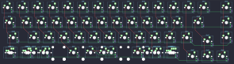

## cannonkeys/adelie

[layout](adelie-kle.json) - [PCB](adelie.kicad_pcb)

{:loading="lazy"}

[Open in keyboard-layout-editor](http://www.keyboard-layout-editor.com/##@@_c=#777777;&=0,0&_c=#cccccc;&=0,1&=0,2&=0,3&=0,4&=0,5&=0,6&=0,7&=0,8&=0,9&=0,10&=0,11&=0,12&_c=#aaaaaa;&=0,13&_x:0.5;&=0,14;&@_w:1.25;&=1,0&_c=#cccccc;&=1,1&=1,2&=1,3&=1,4&=1,5&=1,6&=1,7&=1,8&=1,9&=1,10&=1,11&_c=#aaaaaa&w:1.75;&=1,13&_x:0.5;&=1,14;&@_w:1.75;&=2,0&_c=#cccccc;&=2,1&=2,2&=2,3&=2,4&=2,5&=2,6&=2,7&=2,8&=2,9&=2,11&_c=#aaaaaa&w:1.25;&=2,12&_x:1.5;&=2,14;&@_x:13.25&y:-0.75&c=#777777;&=2,13;&@_y:-0.25&c=#aaaaaa&w:1.25;&=3,0%0A%0A%0A0,0&=3,1%0A%0A%0A0,0&_w:1.25;&=3,2%0A%0A%0A0,0&_c=#cccccc&w:2.75;&=3,3%0A%0A%0A0,0&_w:2.25;&=3,6%0A%0A%0A0,0&_c=#aaaaaa&w:1.25;&=3,8%0A%0A%0A0,0&=3,9%0A%0A%0A0,0&_w:1.25;&=3,11%0A%0A%0A0,0;&@_x:12.25&y:-0.75&c=#777777;&=3,12&=3,13&=3,14;&@_y:0.5&c=#aaaaaa&w:1.25;&=3,0%0A%0A%0A0,1&_w:1.25;&=3,1%0A%0A%0A0,1&_w:1.25;&=3,2%0A%0A%0A0,1&_c=#cccccc&w:6.25;&=3,6%0A%0A%0A0,1&_c=#aaaaaa;&=3,9%0A%0A%0A0,1&=3,11%0A%0A%0A0,1;&@_w:1.5;&=3,0%0A%0A%0A0,2&_w:1.5;&=3,1%0A%0A%0A0,2&_c=#cccccc&w:6;&=3,6%0A%0A%0A0,2&_c=#aaaaaa&w:1.5;&=3,8%0A%0A%0A0,2&_w:1.5;&=3,11%0A%0A%0A0,2)

{:loading="lazy"}

