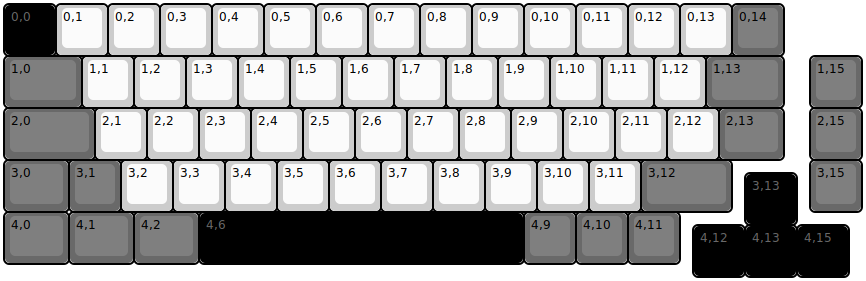
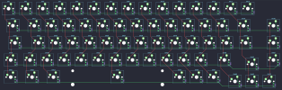

## cannonkeys/chimera65

[layout](chimera65-kle.json) - [PCB](chimera65.kicad_pcb)

{:loading="lazy"}

[Open in keyboard-layout-editor](http://www.keyboard-layout-editor.com/##@@_c=#000000&t=#696969;&=0,0&_c=#cccccc&t=#000000;&=0,1&=0,2&=0,3&=0,4&=0,5&=0,6&=0,7&=0,8&=0,9&=0,10&=0,11&=0,12&=0,13&_c=#696969;&=0,14;&@_w:1.5;&=1,0&_c=#cccccc;&=1,1&=1,2&=1,3&=1,4&=1,5&=1,6&=1,7&=1,8&=1,9&=1,10&=1,11&=1,12&_c=#696969&w:1.5;&=1,13&_x:0.5;&=1,15;&@_w:1.75;&=2,0&_c=#cccccc;&=2,1&=2,2&=2,3&=2,4&=2,5&=2,6&=2,7&=2,8&=2,9&=2,10&=2,11&=2,12&_c=#696969&w:1.25;&=2,13&_x:0.5;&=2,15;&@_w:1.25;&=3,0&=3,1&_c=#cccccc;&=3,2&=3,3&=3,4&=3,5&=3,6&=3,7&=3,8&=3,9&=3,10&=3,11&_c=#696969&w:1.75;&=3,12&_x:1.5;&=3,15;&@_x:14.25&y:-0.75&c=#000000&t=#696969;&=3,13;&@_y:-0.25&c=#696969&t=#000000&w:1.25;&=4,0&_w:1.25;&=4,1&_w:1.25;&=4,2&_c=#000000&t=#696969&w:6.25;&=4,6&_c=#696969&t=#000000;&=4,9&=4,10&=4,11;&@_x:13.25&y:-0.75&c=#000000&t=#696969;&=4,12&=4,13&=4,15)

{:loading="lazy"}

