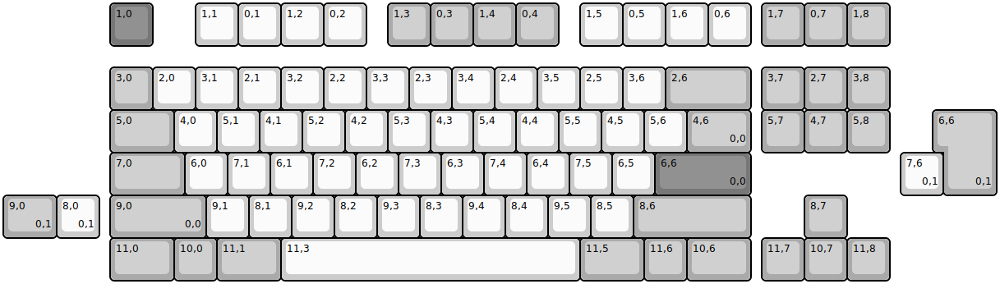
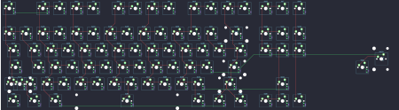

## cannonkeys/hoodrowg

[layout](hoodrowg-kle.json) - [PCB](hoodrowg.kicad_pcb)

{:loading="lazy"}

[Open in keyboard-layout-editor](http://www.keyboard-layout-editor.com/##@@_x:2.5&c=#777777;&=1,0&_x:1.0&c=#cccccc;&=1,1&=0,1&=1,2&=0,2&_x:0.5&c=#aaaaaa;&=1,3&=0,3&=1,4&=0,4&_x:0.5&c=#cccccc;&=1,5&=0,5&=1,6&=0,6&_x:0.25&c=#aaaaaa;&=1,7&=0,7&=1,8;&@_x:2.5&y:0.5;&=3,0&_c=#cccccc;&=2,0&=3,1&=2,1&=3,2&=2,2&=3,3&=2,3&=3,4&=2,4&=3,5&=2,5&=3,6&_c=#aaaaaa&w:2;&=2,6&_x:0.25;&=3,7&=2,7&=3,8;&@_x:2.5&w:1.5;&=5,0&_c=#cccccc;&=4,0&=5,1&=4,1&=5,2&=4,2&=5,3&=4,3&=5,4&=4,4&=5,5&=4,5&=5,6&_c=#aaaaaa&w:1.5;&=4,6%0A%0A%0A0,0&_x:0.25;&=5,7&=4,7&=5,8;&@_x:2.5&w:1.75;&=7,0&_c=#cccccc;&=6,0&=7,1&=6,1&=7,2&=6,2&=7,3&=6,3&=7,4&=6,4&=7,5&=6,5&_c=#777777&w:2.25;&=6,6%0A%0A%0A0,0;&@_x:2.5&c=#aaaaaa&w:2.25;&=9,0%0A%0A%0A0,0&_c=#cccccc;&=9,1&=8,1&=9,2&=8,2&=9,3&=8,3&=9,4&=8,4&=9,5&=8,5&_c=#aaaaaa&w:2.75;&=8,6&_x:1.25;&=8,7;&@_x:2.5&w:1.5;&=11,0&=10,0&_w:1.5;&=11,1&_c=#cccccc&w:7;&=11,3&_c=#aaaaaa&w:1.5;&=11,5&=11,6&_w:1.5;&=10,6&_x:0.25;&=11,7&=10,7&=11,8;&@_x:22.0&y:-4.0&w:1.25&h:2&w2:1.5&h2:1&x2:-0.25;&=6,6%0A%0A%0A0,1;&@_x:21.0&c=#cccccc;&=7,6%0A%0A%0A0,1;&@_c=#aaaaaa&w:1.25;&=9,0%0A%0A%0A0,1&_c=#cccccc;&=8,0%0A%0A%0A0,1)

{:loading="lazy"}

