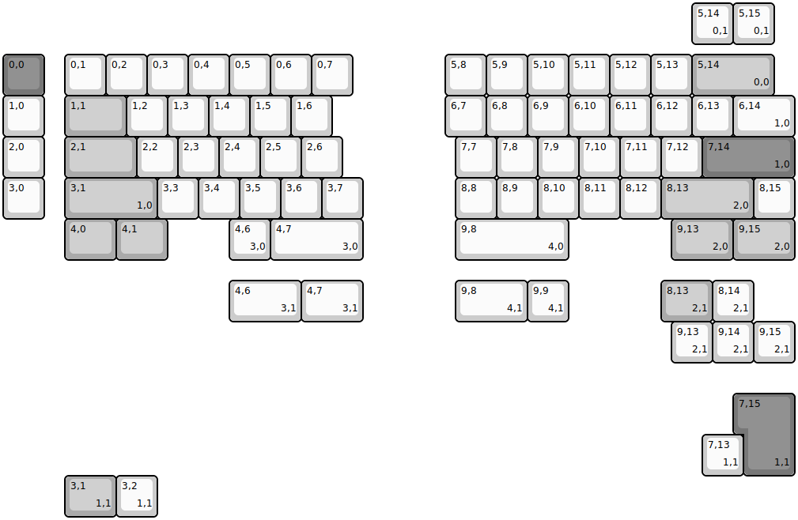
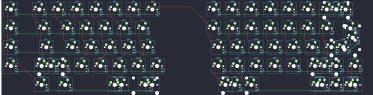

## cannonkeys/sagittarius

[layout](sagittarius-kle.json) - [PCB](sagittarius.kicad_pcb)

{:loading="lazy"}

[Open in keyboard-layout-editor](http://www.keyboard-layout-editor.com/##@@_y:1.25&c=#777777;&=0,0&_x:0.5&c=#cccccc;&=0,1&=0,2&=0,3&=0,4&=0,5&=0,6&=0,7&_x:2.25;&=5,8&=5,9&=5,10&=5,11&=5,12&=5,13&_c=#aaaaaa&w:2;&=5,14%0A%0A%0A0,0;&@_c=#cccccc;&=1,0&_x:0.5&c=#aaaaaa&w:1.5;&=1,1&_c=#cccccc;&=1,2&=1,3&=1,4&=1,5&=1,6&_x:2.75;&=6,7&=6,8&=6,9&=6,10&=6,11&=6,12&=6,13&_w:1.5;&=6,14%0A%0A%0A1,0;&@=2,0&_x:0.5&c=#aaaaaa&w:1.75;&=2,1&_c=#cccccc;&=2,2&=2,3&=2,4&=2,5&=2,6&_x:2.75;&=7,7&=7,8&=7,9&=7,10&=7,11&=7,12&_c=#777777&w:2.25;&=7,14%0A%0A%0A1,0;&@_c=#cccccc;&=3,0&_x:0.5&c=#aaaaaa&w:2.25;&=3,1%0A%0A%0A1,0&_c=#cccccc;&=3,3&=3,4&=3,5&=3,6&=3,7&_x:2.25;&=8,8&=8,9&=8,10&=8,11&=8,12&_c=#aaaaaa&w:2.25;&=8,13%0A%0A%0A2,0&_c=#cccccc;&=8,15;&@_x:1.5&c=#aaaaaa&w:1.25;&=4,0&_w:1.25;&=4,1&_x:1.5&c=#cccccc;&=4,6%0A%0A%0A3,0&_w:2.25;&=4,7%0A%0A%0A3,0&_x:2.25&w:2.75;&=9,8%0A%0A%0A4,0&_x:2.5&c=#aaaaaa&w:1.5;&=9,13%0A%0A%0A2,0&_w:1.5;&=9,15%0A%0A%0A2,0;&@_x:16.75&y:-6.25&c=#cccccc;&=5,14%0A%0A%0A0,1&=5,15%0A%0A%0A0,1;&@_x:5.5&y:5.75&w:1.75;&=4,6%0A%0A%0A3,1&_w:1.5;&=4,7%0A%0A%0A3,1&_x:2.25&w:1.75;&=9,8%0A%0A%0A4,1&=9,9%0A%0A%0A4,1&_x:2.25&c=#aaaaaa&w:1.25;&=8,13%0A%0A%0A2,1&_c=#cccccc;&=8,14%0A%0A%0A2,1;&@_x:16.25;&=9,13%0A%0A%0A2,1&=9,14%0A%0A%0A2,1&=9,15%0A%0A%0A2,1;&@_x:18&y:0.75&c=#777777&w:1.25&h:2&w2:1.5&h2:1&x2:-0.25;&=7,15%0A%0A%0A1,1;&@_x:17&c=#cccccc;&=7,13%0A%0A%0A1,1;&@_x:1.5&c=#aaaaaa&w:1.25;&=3,1%0A%0A%0A1,1&_c=#cccccc;&=3,2%0A%0A%0A1,1)

{:loading="lazy"}

