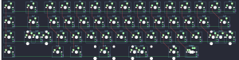

## cannonkeys/tmov2

[layout](tmov2-kle.json) - [PCB](tmov2.kicad_pcb)

{:loading="lazy"}

[Open in keyboard-layout-editor](http://www.keyboard-layout-editor.com/##@@_c=#aaaaaa;&=0,0&_x:0.25&w:1.5;&=0,1&_c=#cccccc;&=0,3&=0,4&=0,5&=0,6&=0,7&=0,8&=0,9&=0,10&=0,11&=0,12&=0,13&=0,14&_c=#aaaaaa;&=0,15;&@=1,0&_x:0.25&w:1.75;&=1,1&_c=#cccccc;&=1,3&=1,4&=1,5&=1,6&=1,7&=1,8&=1,9&=1,10&=1,11&=1,12&=1,13&_c=#777777&w:1.75&l:true;&=1,14;&@_c=#aaaaaa;&=2,0&_x:0.25&w:2.25;&=2,1%0A%0A%0A0,0&_c=#cccccc;&=2,3&=2,4&=2,5&=2,6&=2,7&=2,8&=2,9&=2,10&=2,11&=2,12&_c=#aaaaaa&w:1.25;&=2,13%0A%0A%0A2,0&=2,14%0A%0A%0A2,0;&@=3,0&_x:2.25;&=3,3&_w:1.5;&=3,4&_c=#cccccc&w:2.25;&=3,6%0A%0A%0A1,0&_w:2.75;&=3,8%0A%0A%0A1,0&_c=#aaaaaa&w:1.5;&=3,10%0A%0A%0A1,0&=3,11%0A%0A%0A1,0;&@_x:1.25&y:2&w:1.25;&=2,1%0A%0A%0A0,1&=2,2%0A%0A%0A0,1&_x:10.0&w:2.25;&=2,13%0A%0A%0A2,1;&@_x:5.75&c=#cccccc&w:6.25;&=3,8%0A%0A%0A1,1&_c=#aaaaaa&w:1.25;&=3,11%0A%0A%0A1,1)

{:loading="lazy"}

