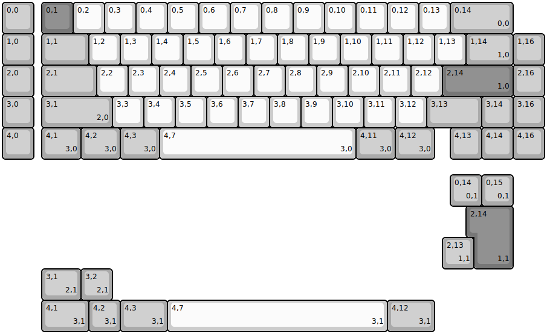
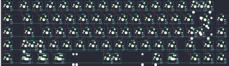

## cannonkeys/tsukuyomi

[layout](tsukuyomi-kle.json) - [PCB](tsukuyomi.kicad_pcb)

{:loading="lazy"}

[Open in keyboard-layout-editor](http://www.keyboard-layout-editor.com/##@@_c=#aaaaaa;&=0,0&_x:0.25&c=#777777;&=0,1&_c=#cccccc;&=0,2&=0,3&=0,4&=0,5&=0,6&=0,7&=0,8&=0,9&=0,10&=0,11&=0,12&=0,13&_c=#aaaaaa&w:2;&=0,14%0A%0A%0A0,0;&@=1,0&_x:0.25&w:1.5;&=1,1&_c=#cccccc;&=1,2&=1,3&=1,4&=1,5&=1,6&=1,7&=1,8&=1,9&=1,10&=1,11&=1,12&=1,13&_c=#aaaaaa&w:1.5;&=1,14%0A%0A%0A1,0&=1,16;&@=2,0&_x:0.25&w:1.75;&=2,1&_c=#cccccc;&=2,2&=2,3&=2,4&=2,5&=2,6&=2,7&=2,8&=2,9&=2,10&=2,11&=2,12&_c=#777777&w:2.25;&=2,14%0A%0A%0A1,0&_c=#aaaaaa;&=2,16;&@=3,0&_x:0.25&w:2.25;&=3,1%0A%0A%0A2,0&_c=#cccccc;&=3,3&=3,4&=3,5&=3,6&=3,7&=3,8&=3,9&=3,10&=3,11&=3,12&_c=#aaaaaa&w:1.75;&=3,13&=3,14&=3,16;&@=4,0&_x:0.25&w:1.25;&=4,1%0A%0A%0A3,0&_w:1.25;&=4,2%0A%0A%0A3,0&_w:1.25;&=4,3%0A%0A%0A3,0&_c=#cccccc&w:6.25;&=4,7%0A%0A%0A3,0&_c=#aaaaaa&w:1.25;&=4,11%0A%0A%0A3,0&_w:1.25;&=4,12%0A%0A%0A3,0&_x:0.5;&=4,13&=4,14&=4,16;&@_x:14.25&y:0.5;&=0,14%0A%0A%0A0,1&=0,15%0A%0A%0A0,1;&@_x:15&c=#777777&w:1.25&h:2&w2:1.5&h2:1&x2:-0.25;&=2,14%0A%0A%0A1,1;&@_x:14&c=#aaaaaa;&=2,13%0A%0A%0A1,1;&@_x:1.25&w:1.25;&=3,1%0A%0A%0A2,1&=3,2%0A%0A%0A2,1;&@_x:1.25&w:1.5;&=4,1%0A%0A%0A3,1&=4,2%0A%0A%0A3,1&_w:1.5;&=4,3%0A%0A%0A3,1&_c=#cccccc&w:7;&=4,7%0A%0A%0A3,1&_c=#aaaaaa&w:1.5;&=4,12%0A%0A%0A3,1)

{:loading="lazy"}

