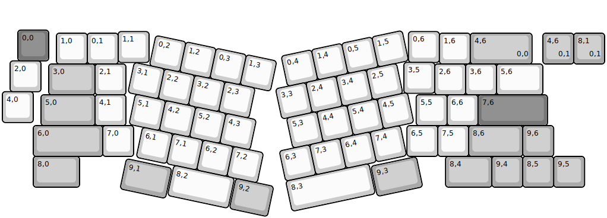
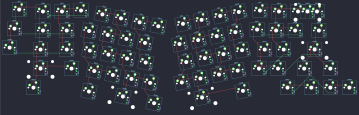

## chalice/chalice

[layout](chalice-kle.json) - [PCB](chalice.kicad_pcb)

{:loading="lazy"}

[Open in keyboard-layout-editor](http://www.keyboard-layout-editor.com/##@@_x:0.5&y:0.9&c=#777777;&=0,0;&@_x:3.75&y:-0.95&c=#cccccc;&=1,1&_x:8.4;&=0,6;&@_x:1.75&y:-0.95;&=1,0&=0,1&_x:10.4;&=1,6&_c=#aaaaaa&w:2;&=4,6%0A%0A%0A0,0;&@_x:0.25&y:-0.1&c=#cccccc;&=2,0;&@_x:13&y:-0.95;&=3,5;&@_x:1.5&y:-0.95&c=#aaaaaa&w:1.5;&=3,0&_c=#cccccc;&=2,1&_x:10.0;&=2,6&=3,6&_w:1.5;&=5,6;&@_y:-0.1;&=4,0;&@_x:1.25&y:-0.9&c=#aaaaaa&w:1.75;&=5,0&_c=#cccccc;&=4,1&_x:9.4;&=5,5&=6,6&_c=#777777&w:2.25;&=7,6;&@_x:1&c=#aaaaaa&w:2.25;&=6,0&_c=#cccccc;&=7,0&_x:8.85;&=6,5&=7,5&_c=#aaaaaa&w:1.75;&=8,6&=9,6;&@_x:1&w:1.5;&=8,0&_x:11.85&w:1.5;&=8,4&=9,4&_x:1.0;&=9,5;&@_ry:0.25&x:16.85&y:4.75;&=8,5;&@_r:12&ry:0&x:5.1&c=#cccccc;&=0,2&=1,2&=0,3&=1,3;&@_x:4.6;&=3,1&=2,2&=3,2&=2,3;&@_x:4.85;&=5,1&=4,2&=5,2&=4,3;&@_x:5.3;&=6,1&=7,1&=6,2&=7,2;&@_x:6.55&w:2;&=8,2&_x:0.05&c=#aaaaaa&w:1.25;&=9,2;&@_x:5&y:-0.89&w:1.5;&=9,1;&@_r:-12&x:8.45&y:-1.51&c=#cccccc;&=0,4&=1,4&=0,5&=1,5;&@_x:8.05;&=3,3&=2,4&=3,4&=2,5;&@_x:8.2;&=5,3&=4,4&=5,4&=4,5;&@_x:7.75;&=6,3&=7,3&=6,4&=7,4;&@_x:7.75&w:2.75;&=8,3;&@_x:10.55&y:-0.9&c=#aaaaaa&w:1.5;&=9,3;&@_r:0&x:17.5&y:-7.7;&=4,6%0A%0A%0A0,1&=8,1%0A%0A%0A0,1)

{:loading="lazy"}

