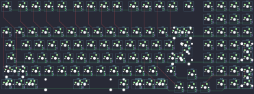

## cherrybstudio/cb1800

[layout](cb1800-kle.json) - [PCB](cb1800.kicad_pcb)

{:loading="lazy"}

[Open in keyboard-layout-editor](http://www.keyboard-layout-editor.com/##@@_x:3&c=#777777;&=0,0&_x:0.25&c=#cccccc;&=0,1&=0,2&=0,3&=0,4&_x:0.25&c=#aaaaaa;&=0,5&=0,6&=0,7&=0,8&_x:0.25&c=#cccccc;&=0,9&=0,10&=1,0&=1,1&_x:0.25&c=#aaaaaa;&=9,9&_x:0.5&c=#cccccc;&=1,2&=1,3&=1,4&=1,5;&@_x:18.5;&=1,6&=1,7&=1,8&=1,9;&@_x:3;&=1,10&=2,0&=2,1&=2,2&=2,3&=2,4&=2,5&=2,6&=2,7&=2,8&=2,9&=2,10&=3,0&_c=#aaaaaa&w:2;&=3,2%0A%0A%0A0,0&_x:0.5&c=#cccccc;&=3,3&=3,4&=3,5&=3,6;&@_x:3&c=#aaaaaa&w:1.5;&=3,7&_c=#cccccc;&=3,8&=3,9&=3,10&=4,0&=4,1&=4,2&=4,3&=4,4&=4,5&=4,6&=4,7&=4,8&_w:1.5;&=4,9%0A%0A%0A1,0&_x:0.5;&=4,10&=5,0&=5,1&=5,2%0A%0A%0A3,0;&@_x:3&c=#aaaaaa&w:1.75;&=5,3&_c=#cccccc;&=5,4&=5,5&=5,6&=5,7&=5,8&=5,9&=5,10&=6,0&=6,1&=6,2&=6,3&_c=#777777&w:2.25;&=6,5%0A%0A%0A1,0&_x:0.5&c=#cccccc;&=6,6&=6,7&=6,8&=6,9%0A%0A%0A3,0;&@_x:3.0&c=#aaaaaa&w:2.25;&=6,10%0A%0A%0A2,0&_c=#cccccc;&=7,1&=7,2&=7,3&=7,4&=7,5&=7,6&=7,7&=7,8&=7,9&=7,10&_c=#aaaaaa&w:1.75;&=8,0&_x:1.5&c=#cccccc;&=8,2&=8,3&=8,4&=8,5%0A%0A%0A3,0;&@_x:17.25&y:-0.75;&=8,1;&@_x:3&y:-0.25&c=#aaaaaa;&=8,6%0A%0A%0A4,0&=8,7%0A%0A%0A4,0&=8,8%0A%0A%0A4,0&_c=#cccccc&w:6;&=8,9%0A%0A%0A4,0&_c=#aaaaaa;&=8,10%0A%0A%0A4,0&=9,0%0A%0A%0A4,0&=9,1%0A%0A%0A4,0&=9,2%0A%0A%0A4,0&_x:3.5&c=#cccccc;&=9,6&=9,7&=9,8%0A%0A%0A3,0;&@_x:16.25&y:-0.75;&=9,3&=9,4&=9,5;&@_x:23.0&y:-5.25;&=3,1%0A%0A%0A0,1&=3,2%0A%0A%0A0,1;&@_x:23.75&c=#777777&w:1.25&h:2&w2:1.5&h2:1&x2:-0.25;&=6,5%0A%0A%0A1,1&_x:0.25&c=#cccccc;&=5,2%0A%0A%0A3,1&_x:0.25&h:2;&=5,2%0A%0A%0A3,2&_x:0.25&h:2;&=5,2%0A%0A%0A3,3;&@_x:22.75;&=6,4%0A%0A%0A1,1&_x:1.5;&=6,9%0A%0A%0A3,1;&@_x:0.25&c=#aaaaaa&w:1.25;&=6,10%0A%0A%0A2,1&_c=#cccccc;&=7,0%0A%0A%0A2,1&_x:22.75&h:2;&=8,5%0A%0A%0A3,1&_x:0.25;&=8,5%0A%0A%0A3,2&_x:0.25&h:2;&=8,5%0A%0A%0A3,3;&@_x:26.5;&=9,8%0A%0A%0A3,2;&@_x:3&y:0.5&c=#aaaaaa&w:1.5;&=8,6%0A%0A%0A4,1&_w:1.5;&=8,8%0A%0A%0A4,1&_c=#cccccc&w:7;&=8,9%0A%0A%0A4,1&_c=#aaaaaa&w:1.5;&=8,10%0A%0A%0A4,1&_w:1.5;&=9,2%0A%0A%0A4,1)

{:loading="lazy"}

