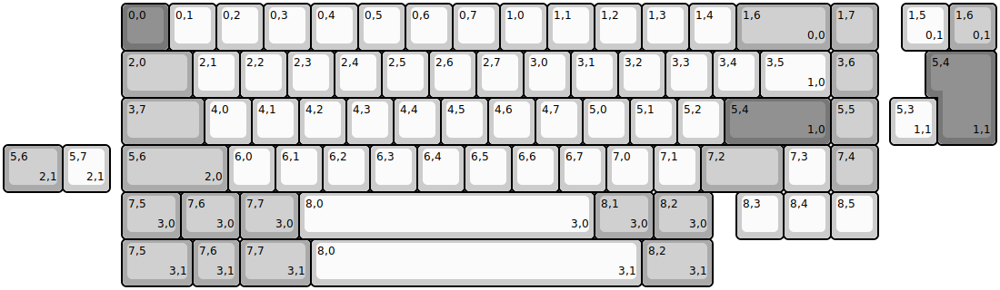
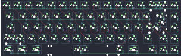

## cherrybstudio/cb65

[layout](cb65-kle.json) - [PCB](cb65.kicad_pcb)

{:loading="lazy"}

[Open in keyboard-layout-editor](http://www.keyboard-layout-editor.com/##@@_x:2.5&c=#777777;&=0,0&_c=#cccccc;&=0,1&=0,2&=0,3&=0,4&=0,5&=0,6&=0,7&=1,0&=1,1&=1,2&=1,3&=1,4&_c=#aaaaaa&w:2;&=1,6%0A%0A%0A0,0&=1,7;&@_x:2.5&w:1.5;&=2,0&_c=#cccccc;&=2,1&=2,2&=2,3&=2,4&=2,5&=2,6&=2,7&=3,0&=3,1&=3,2&=3,3&=3,4&_w:1.5;&=3,5%0A%0A%0A1,0&_c=#aaaaaa;&=3,6;&@_x:2.5&w:1.75;&=3,7&_c=#cccccc;&=4,0&=4,1&=4,2&=4,3&=4,4&=4,5&=4,6&=4,7&=5,0&=5,1&=5,2&_c=#777777&w:2.25;&=5,4%0A%0A%0A1,0&_c=#aaaaaa;&=5,5;&@_x:2.5&w:2.25;&=5,6%0A%0A%0A2,0&_c=#cccccc;&=6,0&=6,1&=6,2&=6,3&=6,4&=6,5&=6,6&=6,7&=7,0&=7,1&_c=#aaaaaa&w:1.75;&=7,2&_c=#cccccc;&=7,3&_c=#aaaaaa;&=7,4;&@_x:2.5&w:1.25;&=7,5%0A%0A%0A3,0&_w:1.25;&=7,6%0A%0A%0A3,0&_w:1.25;&=7,7%0A%0A%0A3,0&_c=#cccccc&w:6.25;&=8,0%0A%0A%0A3,0&_c=#aaaaaa&w:1.25;&=8,1%0A%0A%0A3,0&_w:1.25;&=8,2%0A%0A%0A3,0&_x:0.5&c=#cccccc;&=8,3&=8,4&=8,5;&@_x:19.0&y:-5;&=1,5%0A%0A%0A0,1&_c=#aaaaaa;&=1,6%0A%0A%0A0,1;&@_x:19.75&c=#777777&w:1.25&h:2&w2:1.5&h2:1&x2:-0.25;&=5,4%0A%0A%0A1,1;&@_x:18.75&c=#cccccc;&=5,3%0A%0A%0A1,1;&@_c=#aaaaaa&w:1.25;&=5,6%0A%0A%0A2,1&_c=#cccccc;&=5,7%0A%0A%0A2,1;&@_x:2.5&y:1&c=#aaaaaa&w:1.5;&=7,5%0A%0A%0A3,1&=7,6%0A%0A%0A3,1&_w:1.5;&=7,7%0A%0A%0A3,1&_c=#cccccc&w:7;&=8,0%0A%0A%0A3,1&_c=#aaaaaa&w:1.5;&=8,2%0A%0A%0A3,1)

{:loading="lazy"}

