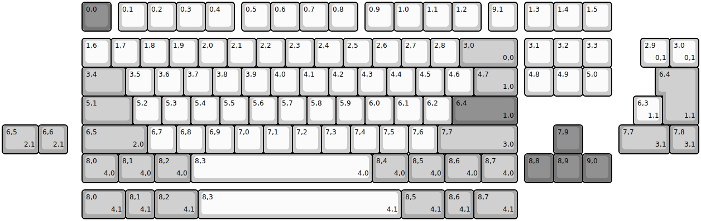
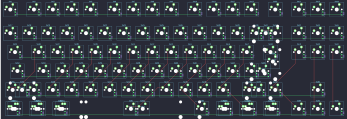

## cherrybstudio/cb87rgb

[layout](cb87rgb-kle.json) - [PCB](cb87rgb.kicad_pcb)

{:loading="lazy"}

[Open in keyboard-layout-editor](http://www.keyboard-layout-editor.com/##@@_x:2.75&c=#777777;&=0,0&_x:0.25&c=#cccccc;&=0,1&=0,2&=0,3&=0,4&_x:0.25;&=0,5&=0,6&=0,7&=0,8&_x:0.25;&=0,9&=1,0&=1,1&=1,2&_x:0.25;&=9,1&_x:0.25;&=1,3&=1,4&=1,5;&@_x:2.75&y:0.25;&=1,6&=1,7&=1,8&=1,9&=2,0&=2,1&=2,2&=2,3&=2,4&=2,5&=2,6&=2,7&=2,8&_c=#aaaaaa&w:2;&=3,0%0A%0A%0A0,0&_x:0.25&c=#cccccc;&=3,1&=3,2&=3,3;&@_x:2.75&c=#aaaaaa&w:1.5;&=3,4&_c=#cccccc;&=3,5&=3,6&=3,7&=3,8&=3,9&=4,0&=4,1&=4,2&=4,3&=4,4&=4,5&=4,6&_c=#aaaaaa&w:1.5;&=4,7%0A%0A%0A1,0&_x:0.25&c=#cccccc;&=4,8&=4,9&=5,0;&@_x:2.75&c=#aaaaaa&w:1.75;&=5,1&_c=#cccccc;&=5,2&=5,3&=5,4&=5,5&=5,6&=5,7&=5,8&=5,9&=6,0&=6,1&=6,2&_c=#777777&w:2.25;&=6,4%0A%0A%0A1,0;&@_x:2.75&c=#aaaaaa&w:2.25;&=6,5%0A%0A%0A2,0&_c=#cccccc;&=6,7&=6,8&=6,9&=7,0&=7,1&=7,2&=7,3&=7,4&=7,5&=7,6&_c=#aaaaaa&w:2.75;&=7,7%0A%0A%0A3,0&_x:1.25&c=#777777;&=7,9;&@_x:2.75&c=#aaaaaa&w:1.25;&=8,0%0A%0A%0A4,0&_w:1.25;&=8,1%0A%0A%0A4,0&_w:1.25;&=8,2%0A%0A%0A4,0&_c=#cccccc&w:6.25;&=8,3%0A%0A%0A4,0&_c=#aaaaaa&w:1.25;&=8,4%0A%0A%0A4,0&_w:1.25;&=8,5%0A%0A%0A4,0&_w:1.25;&=8,6%0A%0A%0A4,0&_w:1.25;&=8,7%0A%0A%0A4,0&_x:0.25&c=#777777;&=8,8&=8,9&=9,0;&@_x:22.0&y:-5.0&c=#cccccc;&=2,9%0A%0A%0A0,1&=3,0%0A%0A%0A0,1;&@_x:22.75&c=#aaaaaa&w:1.25&h:2&w2:1.5&h2:1&x2:-0.25;&=6,4%0A%0A%0A1,1;&@_x:21.75&c=#cccccc;&=6,3%0A%0A%0A1,1;&@_c=#aaaaaa&w:1.25;&=6,5%0A%0A%0A2,1&=6,6%0A%0A%0A2,1&_x:19.0&w:1.75;&=7,7%0A%0A%0A3,1&=7,8%0A%0A%0A3,1;&@_x:2.75&y:1.25&w:1.5;&=8,0%0A%0A%0A4,1&=8,1%0A%0A%0A4,1&_w:1.5;&=8,2%0A%0A%0A4,1&_c=#cccccc&w:7;&=8,3%0A%0A%0A4,1&_c=#aaaaaa&w:1.5;&=8,5%0A%0A%0A4,1&=8,6%0A%0A%0A4,1&_w:1.5;&=8,7%0A%0A%0A4,1)

{:loading="lazy"}

