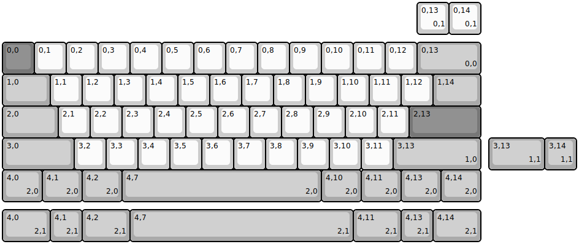
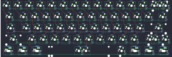
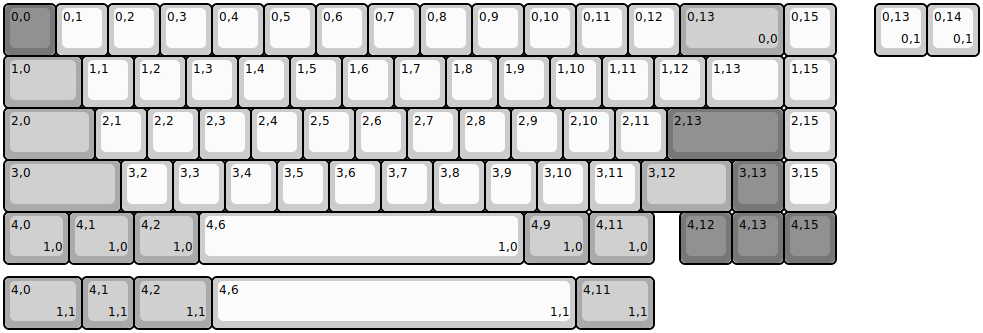
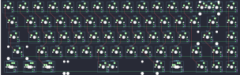

## chickenman/ciel

[layout](ciel-kle.json) - [PCB](ciel.kicad_pcb)

{:loading="lazy"}

[Open in keyboard-layout-editor](http://www.keyboard-layout-editor.com/##@@_y:1.25&c=#777777;&=0,0&_c=#cccccc;&=0,1&=0,2&=0,3&=0,4&=0,5&=0,6&=0,7&=0,8&=0,9&=0,10&=0,11&=0,12&_c=#aaaaaa&w:2;&=0,13%0A%0A%0A0,0;&@_w:1.5;&=1,0&_c=#cccccc;&=1,1&=1,2&=1,3&=1,4&=1,5&=1,6&=1,7&=1,8&=1,9&=1,10&=1,11&=1,12&_c=#aaaaaa&w:1.5;&=1,14;&@_w:1.75;&=2,0&_c=#cccccc;&=2,1&=2,2&=2,3&=2,4&=2,5&=2,6&=2,7&=2,8&=2,9&=2,10&=2,11&_c=#777777&w:2.25;&=2,13;&@_c=#aaaaaa&w:2.25;&=3,0&_c=#cccccc;&=3,2&=3,3&=3,4&=3,5&=3,6&=3,7&=3,8&=3,9&=3,10&=3,11&_c=#aaaaaa&w:2.75;&=3,13%0A%0A%0A1,0;&@_w:1.25;&=4,0%0A%0A%0A2,0&_w:1.25;&=4,1%0A%0A%0A2,0&_w:1.25;&=4,2%0A%0A%0A2,0&_w:6.25;&=4,7%0A%0A%0A2,0&_w:1.25;&=4,10%0A%0A%0A2,0&_w:1.25;&=4,11%0A%0A%0A2,0&_w:1.25;&=4,13%0A%0A%0A2,0&_w:1.25;&=4,14%0A%0A%0A2,0;&@_x:13&y:-6.25&c=#cccccc;&=0,13%0A%0A%0A0,1&=0,14%0A%0A%0A0,1;&@_x:15.25&y:3.25&c=#aaaaaa&w:1.75;&=3,13%0A%0A%0A1,1&=3,14%0A%0A%0A1,1;&@_y:1.25&w:1.5;&=4,0%0A%0A%0A2,1&=4,1%0A%0A%0A2,1&_w:1.5;&=4,2%0A%0A%0A2,1&_w:7;&=4,7%0A%0A%0A2,1&_w:1.5;&=4,11%0A%0A%0A2,1&=4,13%0A%0A%0A2,1&_w:1.5;&=4,14%0A%0A%0A2,1)

{:loading="lazy"}

## chickenman/ciel/ciel65

[layout](ciel65-kle.json) - [PCB](ciel65.kicad_pcb)

{:loading="lazy"}

[Open in keyboard-layout-editor](http://www.keyboard-layout-editor.com/##@@_c=#777777;&=0,0&_c=#cccccc;&=0,1&=0,2&=0,3&=0,4&=0,5&=0,6&=0,7&=0,8&=0,9&=0,10&=0,11&=0,12&_c=#aaaaaa&w:2;&=0,13%0A%0A%0A0,0&_c=#cccccc;&=0,15;&@_c=#aaaaaa&w:1.5;&=1,0&_c=#cccccc;&=1,1&=1,2&=1,3&=1,4&=1,5&=1,6&=1,7&=1,8&=1,9&=1,10&=1,11&=1,12&_w:1.5;&=1,13&=1,15;&@_c=#aaaaaa&w:1.75;&=2,0&_c=#cccccc;&=2,1&=2,2&=2,3&=2,4&=2,5&=2,6&=2,7&=2,8&=2,9&=2,10&=2,11&_c=#777777&w:2.25;&=2,13&_c=#cccccc;&=2,15;&@_c=#aaaaaa&w:2.25;&=3,0&_c=#cccccc;&=3,2&=3,3&=3,4&=3,5&=3,6&=3,7&=3,8&=3,9&=3,10&=3,11&_c=#aaaaaa&w:1.75;&=3,12&_c=#777777;&=3,13&_c=#cccccc;&=3,15;&@_c=#aaaaaa&w:1.25;&=4,0%0A%0A%0A1,0&_w:1.25;&=4,1%0A%0A%0A1,0&_w:1.25;&=4,2%0A%0A%0A1,0&_c=#cccccc&w:6.25;&=4,6%0A%0A%0A1,0&_c=#aaaaaa&w:1.25;&=4,9%0A%0A%0A1,0&_w:1.25;&=4,11%0A%0A%0A1,0&_x:0.5&c=#777777;&=4,12&=4,13&=4,15;&@_x:16.75&y:-5&c=#cccccc;&=0,13%0A%0A%0A0,1&=0,14%0A%0A%0A0,1;&@_rx:0.25&x:-0.25&y:5.25&c=#aaaaaa&w:1.5;&=4,0%0A%0A%0A1,1&=4,1%0A%0A%0A1,1&_w:1.5;&=4,2%0A%0A%0A1,1&_c=#cccccc&w:7;&=4,6%0A%0A%0A1,1&_c=#aaaaaa&w:1.5;&=4,11%0A%0A%0A1,1)

{:loading="lazy"}

