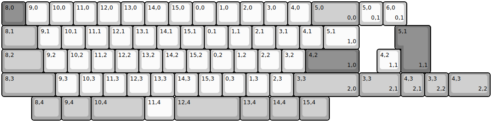
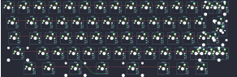

## choc_taro/choc_taro

[layout](choc_taro-kle.json) - [PCB](choc_taro.kicad_pcb)

{:loading="lazy"}

[Open in keyboard-layout-editor](http://www.keyboard-layout-editor.com/##@@_c=#777777;&=8,0&_c=#cccccc;&=9,0&=10,0&=11,0&=12,0&=13,0&=14,0&=15,0&=0,0&=1,0&=2,0&=3,0&=4,0&_c=#aaaaaa&w:2;&=5,0%0A%0A%0A0,0;&@_w:1.5;&=8,1&_c=#cccccc;&=9,1&=10,1&=11,1&=12,1&=13,1&=14,1&=15,1&=0,1&=1,1&=2,1&=3,1&=4,1&_w:1.5;&=5,1%0A%0A%0A1,0;&@_c=#aaaaaa&w:1.75;&=8,2&_c=#cccccc;&=9,2&=10,2&=11,2&=12,2&=13,2&=14,2&=15,2&=0,2&=1,2&=2,2&=3,2&_c=#777777&w:2.25;&=4,2%0A%0A%0A1,0;&@_c=#aaaaaa&w:2.25;&=8,3&_c=#cccccc;&=9,3&=10,3&=11,3&=12,3&=13,3&=14,3&=15,3&=0,3&=1,3&=2,3&_c=#aaaaaa&w:2.75;&=3,3%0A%0A%0A2,0;&@_x:1.25&w:1.25;&=8,4&_w:1.25;&=9,4&_w:2.25;&=10,4&_c=#cccccc&w:1.25;&=11,4&_c=#aaaaaa&w:2.75;&=12,4&_w:1.25;&=13,4&_w:1.25;&=14,4&_w:1.25;&=15,4;&@_x:15&y:-5&c=#cccccc;&=5,0%0A%0A%0A0,1&=6,0%0A%0A%0A0,1;&@_x:16.75&c=#777777&w:1.25&h:2&w2:1.5&h2:1&x2:-0.25;&=5,1%0A%0A%0A1,1;&@_x:15.75&c=#cccccc;&=4,2%0A%0A%0A1,1;&@_x:15.0&c=#aaaaaa&w:1.75;&=3,3%0A%0A%0A2,1&=4,3%0A%0A%0A2,1&=3,3%0A%0A%0A2,2&_w:1.75;&=4,3%0A%0A%0A2,2)

{:loading="lazy"}

