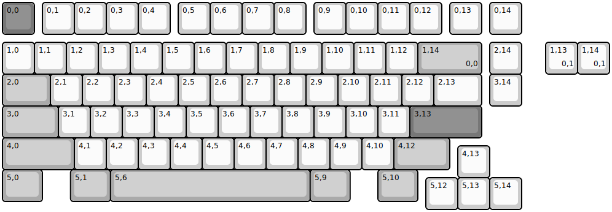
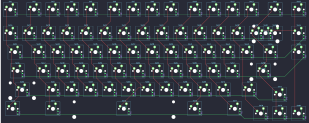

## cipulot/kallos

[layout](kallos-kle.json) - [PCB](kallos.kicad_pcb)

{:loading="lazy"}

[Open in keyboard-layout-editor](http://www.keyboard-layout-editor.com/##@@_c=#777777;&=0,0&_x:0.25&c=#cccccc;&=0,1&=0,2&=0,3&=0,4&_x:0.25;&=0,5&=0,6&=0,7&=0,8&_x:0.25;&=0,9&=0,10&=0,11&=0,12&_x:0.25;&=0,13&_x:0.25;&=0,14;&@_y:0.25;&=1,0&=1,1&=1,2&=1,3&=1,4&=1,5&=1,6&=1,7&=1,8&=1,9&=1,10&=1,11&=1,12&_c=#aaaaaa&w:2;&=1,14%0A%0A%0A0,0&_x:0.25&c=#cccccc;&=2,14;&@_c=#aaaaaa&w:1.5;&=2,0&_c=#cccccc;&=2,1&=2,2&=2,3&=2,4&=2,5&=2,6&=2,7&=2,8&=2,9&=2,10&=2,11&=2,12&_w:1.5;&=2,13&_x:0.25;&=3,14;&@_c=#aaaaaa&w:1.75;&=3,0&_c=#cccccc;&=3,1&=3,2&=3,3&=3,4&=3,5&=3,6&=3,7&=3,8&=3,9&=3,10&=3,11&_c=#777777&w:2.25;&=3,13;&@_c=#aaaaaa&w:2.25;&=4,0&_c=#cccccc;&=4,1&=4,2&=4,3&=4,4&=4,5&=4,6&=4,7&=4,8&=4,9&=4,10&_c=#aaaaaa&w:1.75;&=4,12;&@_x:14.25&y:-0.75&c=#cccccc;&=4,13;&@_y:-0.25&c=#aaaaaa&w:1.25;&=5,0&_x:0.88&w:1.25;&=5,1&_w:6.25;&=5,6&_w:1.25;&=5,9&_x:0.87&w:1.25;&=5,10;&@_x:13.25&y:-0.75&c=#cccccc;&=5,12&=5,13&=5,14;&@_x:17.0&y:-5.25;&=1,13%0A%0A%0A0,1&=1,14%0A%0A%0A0,1)

{:loading="lazy"}

