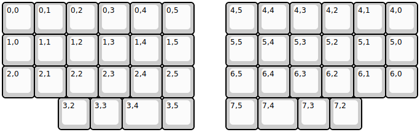
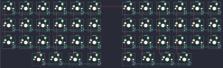

## claw44/claw44

[layout](claw44-kle.json) - [PCB](claw44.kicad_pcb)

{:loading="lazy"}

[Open in keyboard-layout-editor](http://www.keyboard-layout-editor.com/##@@=0,0&=0,1&=0,2&=0,3&=0,4&=0,5&_x:1;&=4,5&=4,4&=4,3&=4,2&=4,1&=4,0;&@=1,0&=1,1&=1,2&=1,3&=1,4&=1,5&_x:1;&=5,5&=5,4&=5,3&=5,2&=5,1&=5,0;&@=2,0&=2,1&=2,2&=2,3&=2,4&=2,5&_x:1;&=6,5&=6,4&=6,3&=6,2&=6,1&=6,0;&@_x:1.75;&=3,2&=3,3&_w:1.25;&=3,4&=3,5&_x:1.0;&=7,5&_w:1.25;&=7,4&=7,3&=7,2)

{:loading="lazy"}

