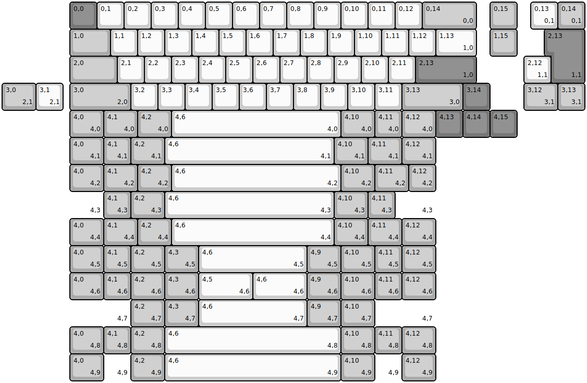
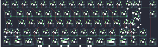
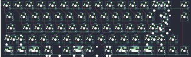
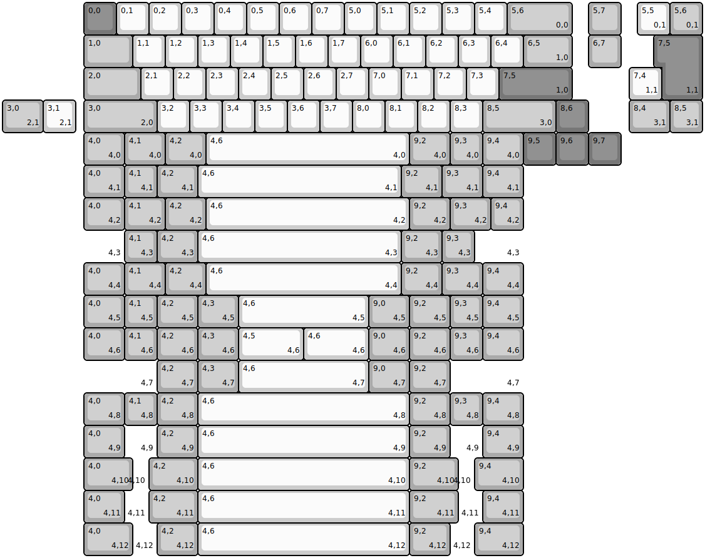
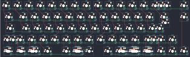

## clueboard/66/clueboard66rev1

[layout](clueboard66rev1-kle.json) - [PCB](clueboard66rev1.kicad_pcb)

{:loading="lazy"}

[Open in keyboard-layout-editor](http://www.keyboard-layout-editor.com/##@@_x:2.5&c=#777777;&=0,0&_c=#cccccc;&=0,1&=0,2&=0,3&=0,4&=0,5&=0,6&=0,7&=0,8&=0,9&=0,10&=0,11&=0,12&_c=#aaaaaa&w:2;&=0,14%0A%0A%0A0,0&_x:0.5;&=0,15;&@_x:2.5&w:1.5;&=1,0&_c=#cccccc;&=1,1&=1,2&=1,3&=1,4&=1,5&=1,6&=1,7&=1,8&=1,9&=1,10&=1,11&=1,12&_w:1.5;&=1,13%0A%0A%0A1,0&_x:0.5&c=#aaaaaa;&=1,15;&@_x:2.5&w:1.75;&=2,0&_c=#cccccc;&=2,1&=2,2&=2,3&=2,4&=2,5&=2,6&=2,7&=2,8&=2,9&=2,10&=2,11&_c=#777777&w:2.25;&=2,13%0A%0A%0A1,0;&@_x:2.5&c=#aaaaaa&w:2.25;&=3,0%0A%0A%0A2,0&_c=#cccccc;&=3,2&=3,3&=3,4&=3,5&=3,6&=3,7&=3,8&=3,9&=3,10&=3,11&_c=#aaaaaa&w:2.25;&=3,13%0A%0A%0A3,0&_c=#777777;&=3,14;&@_x:2.5&c=#aaaaaa&w:1.25;&=4,0%0A%0A%0A4,0&_w:1.25;&=4,1%0A%0A%0A4,0&_w:1.25;&=4,2%0A%0A%0A4,0&_c=#cccccc&w:6.25;&=4,6%0A%0A%0A4,0&_c=#aaaaaa&w:1.25;&=4,10%0A%0A%0A4,0&=4,11%0A%0A%0A4,0&_w:1.25;&=4,12%0A%0A%0A4,0&_c=#777777;&=4,13&=4,14&=4,15;&@_x:19.5&y:-5&c=#cccccc;&=0,13%0A%0A%0A0,1&_c=#aaaaaa;&=0,14%0A%0A%0A0,1;&@_x:20.25&c=#777777&w:1.25&h:2&w2:1.5&h2:1&x2:-0.25;&=2,13%0A%0A%0A1,1;&@_x:19.25&c=#cccccc;&=2,12%0A%0A%0A1,1;&@_c=#aaaaaa&w:1.25;&=3,0%0A%0A%0A2,1&_c=#cccccc;&=3,1%0A%0A%0A2,1&_x:17.0&c=#aaaaaa&w:1.25;&=3,12%0A%0A%0A3,1&=3,13%0A%0A%0A3,1;&@_x:2.5&y:1&w:1.25;&=4,0%0A%0A%0A4,1&=4,1%0A%0A%0A4,1&_w:1.25;&=4,2%0A%0A%0A4,1&_c=#cccccc&w:6.25;&=4,6%0A%0A%0A4,1&_c=#aaaaaa&w:1.25;&=4,10%0A%0A%0A4,1&_w:1.25;&=4,11%0A%0A%0A4,1&_w:1.25;&=4,12%0A%0A%0A4,1;&@_x:2.5&w:1.25;&=4,0%0A%0A%0A4,2&_w:1.25;&=4,1%0A%0A%0A4,2&_w:1.25;&=4,2%0A%0A%0A4,2&_c=#cccccc&w:6.25;&=4,6%0A%0A%0A4,2&_c=#aaaaaa&w:1.25;&=4,10%0A%0A%0A4,2&_w:1.25;&=4,11%0A%0A%0A4,2&=4,12%0A%0A%0A4,2;&@_x:2.5&w:1.25&d:true;&=%0A%0A%0A4,3&=4,1%0A%0A%0A4,3&_w:1.25;&=4,2%0A%0A%0A4,3&_c=#cccccc&w:6.25;&=4,6%0A%0A%0A4,3&_c=#aaaaaa&w:1.25;&=4,10%0A%0A%0A4,3&=4,11%0A%0A%0A4,3&_w:1.5&d:true;&=%0A%0A%0A4,3;&@_x:2.5&w:1.25;&=4,0%0A%0A%0A4,4&_w:1.25;&=4,1%0A%0A%0A4,4&_w:1.25;&=4,2%0A%0A%0A4,4&_c=#cccccc&w:6;&=4,6%0A%0A%0A4,4&_c=#aaaaaa&w:1.25;&=4,10%0A%0A%0A4,4&_w:1.25;&=4,11%0A%0A%0A4,4&_w:1.25;&=4,12%0A%0A%0A4,4;&@_x:2.5&w:1.25;&=4,0%0A%0A%0A4,5&=4,1%0A%0A%0A4,5&_w:1.25;&=4,2%0A%0A%0A4,5&_w:1.25;&=4,3%0A%0A%0A4,5&_c=#cccccc&w:4;&=4,6%0A%0A%0A4,5&_c=#aaaaaa&w:1.25;&=4,9%0A%0A%0A4,5&_w:1.25;&=4,10%0A%0A%0A4,5&=4,11%0A%0A%0A4,5&_w:1.25;&=4,12%0A%0A%0A4,5;&@_x:2.5&w:1.25;&=4,0%0A%0A%0A4,6&=4,1%0A%0A%0A4,6&_w:1.25;&=4,2%0A%0A%0A4,6&_w:1.25;&=4,3%0A%0A%0A4,6&_c=#cccccc&w:2;&=4,5%0A%0A%0A4,6&_w:2;&=4,6%0A%0A%0A4,6&_c=#aaaaaa&w:1.25;&=4,9%0A%0A%0A4,6&_w:1.25;&=4,10%0A%0A%0A4,6&=4,11%0A%0A%0A4,6&_w:1.25;&=4,12%0A%0A%0A4,6;&@_x:2.5&w:2.25&d:true;&=%0A%0A%0A4,7&_w:1.25;&=4,2%0A%0A%0A4,7&_w:1.25;&=4,3%0A%0A%0A4,7&_c=#cccccc&w:4;&=4,6%0A%0A%0A4,7&_c=#aaaaaa&w:1.25;&=4,9%0A%0A%0A4,7&_w:1.25;&=4,10%0A%0A%0A4,7&_w:2.25&d:true;&=%0A%0A%0A4,7;&@_x:2.5&w:1.25;&=4,0%0A%0A%0A4,8&=4,1%0A%0A%0A4,8&_w:1.25;&=4,2%0A%0A%0A4,8&_c=#cccccc&w:6.5;&=4,6%0A%0A%0A4,8&_c=#aaaaaa&w:1.25;&=4,10%0A%0A%0A4,8&=4,11%0A%0A%0A4,8&_w:1.25;&=4,12%0A%0A%0A4,8;&@_x:2.5&w:1.25;&=4,0%0A%0A%0A4,9&_d:true;&=%0A%0A%0A4,9&_w:1.25;&=4,2%0A%0A%0A4,9&_c=#cccccc&w:6.5;&=4,6%0A%0A%0A4,9&_c=#aaaaaa&w:1.25;&=4,10%0A%0A%0A4,9&_d:true;&=%0A%0A%0A4,9&_w:1.25;&=4,12%0A%0A%0A4,9)

{:loading="lazy"}

## clueboard/66/clueboard66rev2

[layout](clueboard66rev2-kle.json) - [PCB](clueboard66rev2.kicad_pcb)

{:loading="lazy"}

[Open in keyboard-layout-editor](http://www.keyboard-layout-editor.com/##@@_x:2.5&c=#777777;&=0,0&_c=#cccccc;&=0,1&=0,2&=0,3&=0,4&=0,5&=0,6&=0,7&=5,0&=5,1&=5,2&=5,3&=5,4&_c=#aaaaaa&w:2;&=5,6%0A%0A%0A0,0&_x:0.5;&=5,7;&@_x:2.5&w:1.5;&=1,0&_c=#cccccc;&=1,1&=1,2&=1,3&=1,4&=1,5&=1,6&=1,7&=6,0&=6,1&=6,2&=6,3&=6,4&_c=#aaaaaa&w:1.5;&=6,5%0A%0A%0A1,0&_x:0.5;&=6,7;&@_x:2.5&w:1.75;&=2,0&_c=#cccccc;&=2,1&=2,2&=2,3&=2,4&=2,5&=2,6&=2,7&=7,0&=7,1&=7,2&=7,3&_c=#777777&w:2.25;&=7,5%0A%0A%0A1,0;&@_x:2.5&c=#aaaaaa&w:2.25;&=3,0%0A%0A%0A2,0&_c=#cccccc;&=3,2&=3,3&=3,4&=3,5&=3,6&=3,7&=8,0&=8,1&=8,2&=8,3&_c=#aaaaaa&w:2.25;&=8,5%0A%0A%0A3,0&_c=#777777;&=8,6;&@_x:2.5&c=#aaaaaa&w:1.25;&=4,0%0A%0A%0A4,0&_w:1.25;&=4,1%0A%0A%0A4,0&_w:1.25;&=4,2%0A%0A%0A4,0&_c=#cccccc&w:6.25;&=4,6%0A%0A%0A4,0&_c=#aaaaaa&w:1.25;&=9,2%0A%0A%0A4,0&=9,3%0A%0A%0A4,0&_w:1.25;&=9,4%0A%0A%0A4,0&_c=#777777;&=9,5&=9,6&=9,7;&@_x:19.5&y:-5&c=#cccccc;&=5,5%0A%0A%0A0,1&_c=#aaaaaa;&=5,6%0A%0A%0A0,1;&@_x:20.25&c=#777777&w:1.25&h:2&w2:1.5&h2:1&x2:-0.25;&=7,5%0A%0A%0A1,1;&@_x:19.25&c=#cccccc;&=7,4%0A%0A%0A1,1;&@_c=#aaaaaa&w:1.25;&=3,0%0A%0A%0A2,1&_c=#cccccc;&=3,1%0A%0A%0A2,1&_x:17.0&c=#aaaaaa&w:1.25;&=8,4%0A%0A%0A3,1&=8,5%0A%0A%0A3,1;&@_x:2.5&y:1&w:1.25;&=4,0%0A%0A%0A4,1&=4,1%0A%0A%0A4,1&_w:1.25;&=4,2%0A%0A%0A4,1&_c=#cccccc&w:6.25;&=4,6%0A%0A%0A4,1&_c=#aaaaaa&w:1.25;&=9,2%0A%0A%0A4,1&_w:1.25;&=9,3%0A%0A%0A4,1&_w:1.25;&=9,4%0A%0A%0A4,1;&@_x:2.5&w:1.25;&=4,0%0A%0A%0A4,2&_w:1.25;&=4,1%0A%0A%0A4,2&_w:1.25;&=4,2%0A%0A%0A4,2&_c=#cccccc&w:6.25;&=4,6%0A%0A%0A4,2&_c=#aaaaaa&w:1.25;&=9,2%0A%0A%0A4,2&_w:1.25;&=9,3%0A%0A%0A4,2&=9,4%0A%0A%0A4,2;&@_x:2.5&w:1.25&d:true;&=%0A%0A%0A4,3&=4,1%0A%0A%0A4,3&_w:1.25;&=4,2%0A%0A%0A4,3&_c=#cccccc&w:6.25;&=4,6%0A%0A%0A4,3&_c=#aaaaaa&w:1.25;&=9,2%0A%0A%0A4,3&=9,3%0A%0A%0A4,3&_w:1.5&d:true;&=%0A%0A%0A4,3;&@_x:2.5&w:1.25;&=4,0%0A%0A%0A4,4&_w:1.25;&=4,1%0A%0A%0A4,4&_w:1.25;&=4,2%0A%0A%0A4,4&_c=#cccccc&w:6;&=4,6%0A%0A%0A4,4&_c=#aaaaaa&w:1.25;&=9,2%0A%0A%0A4,4&_w:1.25;&=9,3%0A%0A%0A4,4&_w:1.25;&=9,4%0A%0A%0A4,4;&@_x:2.5&w:1.25;&=4,0%0A%0A%0A4,5&=4,1%0A%0A%0A4,5&_w:1.25;&=4,2%0A%0A%0A4,5&_w:1.25;&=4,3%0A%0A%0A4,5&_c=#cccccc&w:4;&=4,6%0A%0A%0A4,5&_c=#aaaaaa&w:1.25;&=9,0%0A%0A%0A4,5&_w:1.25;&=9,2%0A%0A%0A4,5&=9,3%0A%0A%0A4,5&_w:1.25;&=9,4%0A%0A%0A4,5;&@_x:2.5&w:1.25;&=4,0%0A%0A%0A4,6&=4,1%0A%0A%0A4,6&_w:1.25;&=4,2%0A%0A%0A4,6&_w:1.25;&=4,3%0A%0A%0A4,6&_c=#cccccc&w:2;&=4,5%0A%0A%0A4,6&_w:2;&=4,6%0A%0A%0A4,6&_c=#aaaaaa&w:1.25;&=9,0%0A%0A%0A4,6&_w:1.25;&=9,2%0A%0A%0A4,6&=9,3%0A%0A%0A4,6&_w:1.25;&=9,4%0A%0A%0A4,6;&@_x:2.5&w:2.25&d:true;&=%0A%0A%0A4,7&_w:1.25;&=4,2%0A%0A%0A4,7&_w:1.25;&=4,3%0A%0A%0A4,7&_c=#cccccc&w:4;&=4,6%0A%0A%0A4,7&_c=#aaaaaa&w:1.25;&=9,0%0A%0A%0A4,7&_w:1.25;&=9,2%0A%0A%0A4,7&_w:2.25&d:true;&=%0A%0A%0A4,7;&@_x:2.5&w:1.25;&=4,0%0A%0A%0A4,8&=4,1%0A%0A%0A4,8&_w:1.25;&=4,2%0A%0A%0A4,8&_c=#cccccc&w:6.5;&=4,6%0A%0A%0A4,8&_c=#aaaaaa&w:1.25;&=9,2%0A%0A%0A4,8&=9,3%0A%0A%0A4,8&_w:1.25;&=9,4%0A%0A%0A4,8;&@_x:2.5&w:1.25;&=4,0%0A%0A%0A4,9&_d:true;&=%0A%0A%0A4,9&_w:1.25;&=4,2%0A%0A%0A4,9&_c=#cccccc&w:6.5;&=4,6%0A%0A%0A4,9&_c=#aaaaaa&w:1.25;&=9,2%0A%0A%0A4,9&_d:true;&=%0A%0A%0A4,9&_w:1.25;&=9,4%0A%0A%0A4,9;&@_x:2.5&w:1.5;&=4,0%0A%0A%0A4,10&_w:0.5&d:true;&=%0A%0A%0A4,10&_w:1.5;&=4,2%0A%0A%0A4,10&_c=#cccccc&w:6.5;&=4,6%0A%0A%0A4,10&_c=#aaaaaa&w:1.5;&=9,2%0A%0A%0A4,10&_w:0.5&d:true;&=%0A%0A%0A4,10&_w:1.5;&=9,4%0A%0A%0A4,10;&@_x:2.5&w:1.25;&=4,0%0A%0A%0A4,11&_w:0.75&d:true;&=%0A%0A%0A4,11&_w:1.5;&=4,2%0A%0A%0A4,11&_c=#cccccc&w:6.5;&=4,6%0A%0A%0A4,11&_c=#aaaaaa&w:1.5;&=9,2%0A%0A%0A4,11&_w:0.75&d:true;&=%0A%0A%0A4,11&_w:1.25;&=9,4%0A%0A%0A4,11;&@_x:2.5&w:1.5;&=4,0%0A%0A%0A4,12&_w:0.75&d:true;&=%0A%0A%0A4,12&_w:1.25;&=4,2%0A%0A%0A4,12&_c=#cccccc&w:6.5;&=4,6%0A%0A%0A4,12&_c=#aaaaaa&w:1.25;&=9,2%0A%0A%0A4,12&_w:0.75&d:true;&=%0A%0A%0A4,12&_w:1.5;&=9,4%0A%0A%0A4,12)

{:loading="lazy"}

## clueboard/66/clueboard66rev3

[layout](clueboard66rev3-kle.json) - [PCB](clueboard66rev3.kicad_pcb)

{:loading="lazy"}

[Open in keyboard-layout-editor](http://www.keyboard-layout-editor.com/##@@_x:2.5&c=#777777;&=0,0&_c=#cccccc;&=0,1&=0,2&=0,3&=0,4&=0,5&=0,6&=0,7&=5,0&=5,1&=5,2&=5,3&=5,4&_c=#aaaaaa&w:2;&=5,6%0A%0A%0A0,0&_x:0.5;&=5,7;&@_x:2.5&w:1.5;&=1,0&_c=#cccccc;&=1,1&=1,2&=1,3&=1,4&=1,5&=1,6&=1,7&=6,0&=6,1&=6,2&=6,3&=6,4&_c=#aaaaaa&w:1.5;&=6,5%0A%0A%0A1,0&_x:0.5;&=6,7;&@_x:2.5&w:1.75;&=2,0&_c=#cccccc;&=2,1&=2,2&=2,3&=2,4&=2,5&=2,6&=2,7&=7,0&=7,1&=7,2&=7,3&_c=#777777&w:2.25;&=7,5%0A%0A%0A1,0;&@_x:2.5&c=#aaaaaa&w:2.25;&=3,0%0A%0A%0A2,0&_c=#cccccc;&=3,2&=3,3&=3,4&=3,5&=3,6&=3,7&=8,0&=8,1&=8,2&=8,3&_c=#aaaaaa&w:2.25;&=8,5%0A%0A%0A3,0&_c=#777777;&=8,6;&@_x:2.5&c=#aaaaaa&w:1.25;&=4,0%0A%0A%0A4,0&_w:1.25;&=4,1%0A%0A%0A4,0&_w:1.25;&=4,2%0A%0A%0A4,0&_c=#cccccc&w:6.25;&=4,6%0A%0A%0A4,0&_c=#aaaaaa&w:1.25;&=9,2%0A%0A%0A4,0&=9,3%0A%0A%0A4,0&_w:1.25;&=9,4%0A%0A%0A4,0&_c=#777777;&=9,5&=9,6&=9,7;&@_x:19.5&y:-5&c=#cccccc;&=5,5%0A%0A%0A0,1&_c=#aaaaaa;&=5,6%0A%0A%0A0,1;&@_x:20.25&c=#777777&w:1.25&h:2&w2:1.5&h2:1&x2:-0.25;&=7,5%0A%0A%0A1,1;&@_x:19.25&c=#cccccc;&=7,4%0A%0A%0A1,1;&@_c=#aaaaaa&w:1.25;&=3,0%0A%0A%0A2,1&_c=#cccccc;&=3,1%0A%0A%0A2,1&_x:17.0&c=#aaaaaa&w:1.25;&=8,4%0A%0A%0A3,1&=8,5%0A%0A%0A3,1;&@_x:2.5&y:1&w:1.25;&=4,0%0A%0A%0A4,1&=4,1%0A%0A%0A4,1&_w:1.25;&=4,2%0A%0A%0A4,1&_c=#cccccc&w:6.25;&=4,6%0A%0A%0A4,1&_c=#aaaaaa&w:1.25;&=9,2%0A%0A%0A4,1&_w:1.25;&=9,3%0A%0A%0A4,1&_w:1.25;&=9,4%0A%0A%0A4,1;&@_x:2.5&w:1.25;&=4,0%0A%0A%0A4,2&_w:1.25;&=4,1%0A%0A%0A4,2&_w:1.25;&=4,2%0A%0A%0A4,2&_c=#cccccc&w:6.25;&=4,6%0A%0A%0A4,2&_c=#aaaaaa&w:1.25;&=9,2%0A%0A%0A4,2&_w:1.25;&=9,3%0A%0A%0A4,2&=9,4%0A%0A%0A4,2;&@_x:2.5&w:1.25&d:true;&=%0A%0A%0A4,3&=4,1%0A%0A%0A4,3&_w:1.25;&=4,2%0A%0A%0A4,3&_c=#cccccc&w:6.25;&=4,6%0A%0A%0A4,3&_c=#aaaaaa&w:1.25;&=9,2%0A%0A%0A4,3&=9,3%0A%0A%0A4,3&_w:1.5&d:true;&=%0A%0A%0A4,3;&@_x:2.5&w:1.25;&=4,0%0A%0A%0A4,4&_w:1.25;&=4,1%0A%0A%0A4,4&_w:1.25;&=4,2%0A%0A%0A4,4&_c=#cccccc&w:6;&=4,6%0A%0A%0A4,4&_c=#aaaaaa&w:1.25;&=9,2%0A%0A%0A4,4&_w:1.25;&=9,3%0A%0A%0A4,4&_w:1.25;&=9,4%0A%0A%0A4,4;&@_x:2.5&w:1.25;&=4,0%0A%0A%0A4,5&=4,1%0A%0A%0A4,5&_w:1.25;&=4,2%0A%0A%0A4,5&_w:1.25;&=4,3%0A%0A%0A4,5&_c=#cccccc&w:4;&=4,6%0A%0A%0A4,5&_c=#aaaaaa&w:1.25;&=9,0%0A%0A%0A4,5&_w:1.25;&=9,2%0A%0A%0A4,5&=9,3%0A%0A%0A4,5&_w:1.25;&=9,4%0A%0A%0A4,5;&@_x:2.5&w:1.25;&=4,0%0A%0A%0A4,6&=4,1%0A%0A%0A4,6&_w:1.25;&=4,2%0A%0A%0A4,6&_w:1.25;&=4,3%0A%0A%0A4,6&_c=#cccccc&w:2;&=4,5%0A%0A%0A4,6&_w:2;&=4,6%0A%0A%0A4,6&_c=#aaaaaa&w:1.25;&=9,0%0A%0A%0A4,6&_w:1.25;&=9,2%0A%0A%0A4,6&=9,3%0A%0A%0A4,6&_w:1.25;&=9,4%0A%0A%0A4,6;&@_x:2.5&w:2.25&d:true;&=%0A%0A%0A4,7&_w:1.25;&=4,2%0A%0A%0A4,7&_w:1.25;&=4,3%0A%0A%0A4,7&_c=#cccccc&w:4;&=4,6%0A%0A%0A4,7&_c=#aaaaaa&w:1.25;&=9,0%0A%0A%0A4,7&_w:1.25;&=9,2%0A%0A%0A4,7&_w:2.25&d:true;&=%0A%0A%0A4,7;&@_x:2.5&w:1.25;&=4,0%0A%0A%0A4,8&=4,1%0A%0A%0A4,8&_w:1.25;&=4,2%0A%0A%0A4,8&_c=#cccccc&w:6.5;&=4,6%0A%0A%0A4,8&_c=#aaaaaa&w:1.25;&=9,2%0A%0A%0A4,8&=9,3%0A%0A%0A4,8&_w:1.25;&=9,4%0A%0A%0A4,8;&@_x:2.5&w:1.25;&=4,0%0A%0A%0A4,9&_d:true;&=%0A%0A%0A4,9&_w:1.25;&=4,2%0A%0A%0A4,9&_c=#cccccc&w:6.5;&=4,6%0A%0A%0A4,9&_c=#aaaaaa&w:1.25;&=9,2%0A%0A%0A4,9&_d:true;&=%0A%0A%0A4,9&_w:1.25;&=9,4%0A%0A%0A4,9;&@_x:2.5&w:1.5;&=4,0%0A%0A%0A4,10&_w:0.5&d:true;&=%0A%0A%0A4,10&_w:1.5;&=4,2%0A%0A%0A4,10&_c=#cccccc&w:6.5;&=4,6%0A%0A%0A4,10&_c=#aaaaaa&w:1.5;&=9,2%0A%0A%0A4,10&_w:0.5&d:true;&=%0A%0A%0A4,10&_w:1.5;&=9,4%0A%0A%0A4,10;&@_x:2.5&w:1.25;&=4,0%0A%0A%0A4,11&_w:0.75&d:true;&=%0A%0A%0A4,11&_w:1.5;&=4,2%0A%0A%0A4,11&_c=#cccccc&w:6.5;&=4,6%0A%0A%0A4,11&_c=#aaaaaa&w:1.5;&=9,2%0A%0A%0A4,11&_w:0.75&d:true;&=%0A%0A%0A4,11&_w:1.25;&=9,4%0A%0A%0A4,11;&@_x:2.5&w:1.5;&=4,0%0A%0A%0A4,12&_w:0.75&d:true;&=%0A%0A%0A4,12&_w:1.25;&=4,2%0A%0A%0A4,12&_c=#cccccc&w:6.5;&=4,6%0A%0A%0A4,12&_c=#aaaaaa&w:1.25;&=9,2%0A%0A%0A4,12&_w:0.75&d:true;&=%0A%0A%0A4,12&_w:1.5;&=9,4%0A%0A%0A4,12)

{:loading="lazy"}

## clueboard/66/clueboard66rev4

[layout](clueboard66rev4-kle.json) - [PCB](clueboard66rev4.kicad_pcb)

{:loading="lazy"}

[Open in keyboard-layout-editor](http://www.keyboard-layout-editor.com/##@@_x:2.5&c=#777777;&=0,0&_c=#cccccc;&=0,1&=0,2&=0,3&=0,4&=0,5&=0,6&=0,7&=5,0&=5,1&=5,2&=5,3&=5,4&_c=#aaaaaa&w:2;&=5,6%0A%0A%0A0,0&_x:0.5;&=5,7;&@_x:2.5&w:1.5;&=1,0&_c=#cccccc;&=1,1&=1,2&=1,3&=1,4&=1,5&=1,6&=1,7&=6,0&=6,1&=6,2&=6,3&=6,4&_c=#aaaaaa&w:1.5;&=6,5%0A%0A%0A1,0&_x:0.5;&=6,7;&@_x:2.5&w:1.75;&=2,0&_c=#cccccc;&=2,1&=2,2&=2,3&=2,4&=2,5&=2,6&=2,7&=7,0&=7,1&=7,2&=7,3&_c=#777777&w:2.25;&=7,5%0A%0A%0A1,0;&@_x:2.5&c=#aaaaaa&w:2.25;&=3,0%0A%0A%0A2,0&_c=#cccccc;&=3,2&=3,3&=3,4&=3,5&=3,6&=3,7&=8,0&=8,1&=8,2&=8,3&_c=#aaaaaa&w:2.25;&=8,5%0A%0A%0A3,0&_c=#777777;&=8,6;&@_x:2.5&c=#aaaaaa&w:1.25;&=4,0%0A%0A%0A4,0&_w:1.25;&=4,1%0A%0A%0A4,0&_w:1.25;&=4,2%0A%0A%0A4,0&_c=#cccccc&w:6.25;&=4,6%0A%0A%0A4,0&_c=#aaaaaa&w:1.25;&=9,2%0A%0A%0A4,0&=9,3%0A%0A%0A4,0&_w:1.25;&=9,4%0A%0A%0A4,0&_c=#777777;&=9,5&=9,6&=9,7;&@_x:19.5&y:-5&c=#cccccc;&=5,5%0A%0A%0A0,1&_c=#aaaaaa;&=5,6%0A%0A%0A0,1;&@_x:20.25&c=#777777&w:1.25&h:2&w2:1.5&h2:1&x2:-0.25;&=7,5%0A%0A%0A1,1;&@_x:19.25&c=#cccccc;&=7,4%0A%0A%0A1,1;&@_c=#aaaaaa&w:1.25;&=3,0%0A%0A%0A2,1&_c=#cccccc;&=3,1%0A%0A%0A2,1&_x:17.0&c=#aaaaaa&w:1.25;&=8,4%0A%0A%0A3,1&=8,5%0A%0A%0A3,1;&@_x:2.5&y:1&w:1.25;&=4,0%0A%0A%0A4,1&=4,1%0A%0A%0A4,1&_w:1.25;&=4,2%0A%0A%0A4,1&_c=#cccccc&w:6.25;&=4,6%0A%0A%0A4,1&_c=#aaaaaa&w:1.25;&=9,2%0A%0A%0A4,1&_w:1.25;&=9,3%0A%0A%0A4,1&_w:1.25;&=9,4%0A%0A%0A4,1;&@_x:2.5&w:1.25;&=4,0%0A%0A%0A4,2&_w:1.25;&=4,1%0A%0A%0A4,2&_w:1.25;&=4,2%0A%0A%0A4,2&_c=#cccccc&w:6.25;&=4,6%0A%0A%0A4,2&_c=#aaaaaa&w:1.25;&=9,2%0A%0A%0A4,2&_w:1.25;&=9,3%0A%0A%0A4,2&=9,4%0A%0A%0A4,2;&@_x:2.5&w:1.25&d:true;&=%0A%0A%0A4,3&=4,1%0A%0A%0A4,3&_w:1.25;&=4,2%0A%0A%0A4,3&_c=#cccccc&w:6.25;&=4,6%0A%0A%0A4,3&_c=#aaaaaa&w:1.25;&=9,2%0A%0A%0A4,3&=9,3%0A%0A%0A4,3&_w:1.5&d:true;&=%0A%0A%0A4,3;&@_x:2.5&w:1.25;&=4,0%0A%0A%0A4,4&_w:1.25;&=4,1%0A%0A%0A4,4&_w:1.25;&=4,2%0A%0A%0A4,4&_c=#cccccc&w:6;&=4,6%0A%0A%0A4,4&_c=#aaaaaa&w:1.25;&=9,2%0A%0A%0A4,4&_w:1.25;&=9,3%0A%0A%0A4,4&_w:1.25;&=9,4%0A%0A%0A4,4;&@_x:2.5&w:1.25;&=4,0%0A%0A%0A4,5&=4,1%0A%0A%0A4,5&_w:1.25;&=4,2%0A%0A%0A4,5&_w:1.25;&=4,3%0A%0A%0A4,5&_c=#cccccc&w:4;&=4,6%0A%0A%0A4,5&_c=#aaaaaa&w:1.25;&=9,0%0A%0A%0A4,5&_w:1.25;&=9,2%0A%0A%0A4,5&=9,3%0A%0A%0A4,5&_w:1.25;&=9,4%0A%0A%0A4,5;&@_x:2.5&w:1.25;&=4,0%0A%0A%0A4,6&=4,1%0A%0A%0A4,6&_w:1.25;&=4,2%0A%0A%0A4,6&_w:1.25;&=4,3%0A%0A%0A4,6&_c=#cccccc&w:2;&=4,5%0A%0A%0A4,6&_w:2;&=4,6%0A%0A%0A4,6&_c=#aaaaaa&w:1.25;&=9,0%0A%0A%0A4,6&_w:1.25;&=9,2%0A%0A%0A4,6&=9,3%0A%0A%0A4,6&_w:1.25;&=9,4%0A%0A%0A4,6;&@_x:2.5&w:2.25&d:true;&=%0A%0A%0A4,7&_w:1.25;&=4,2%0A%0A%0A4,7&_w:1.25;&=4,3%0A%0A%0A4,7&_c=#cccccc&w:4;&=4,6%0A%0A%0A4,7&_c=#aaaaaa&w:1.25;&=9,0%0A%0A%0A4,7&_w:1.25;&=9,2%0A%0A%0A4,7&_w:2.25&d:true;&=%0A%0A%0A4,7;&@_x:2.5&w:1.25;&=4,0%0A%0A%0A4,8&=4,1%0A%0A%0A4,8&_w:1.25;&=4,2%0A%0A%0A4,8&_c=#cccccc&w:6.5;&=4,6%0A%0A%0A4,8&_c=#aaaaaa&w:1.25;&=9,2%0A%0A%0A4,8&=9,3%0A%0A%0A4,8&_w:1.25;&=9,4%0A%0A%0A4,8;&@_x:2.5&w:1.25;&=4,0%0A%0A%0A4,9&_d:true;&=%0A%0A%0A4,9&_w:1.25;&=4,2%0A%0A%0A4,9&_c=#cccccc&w:6.5;&=4,6%0A%0A%0A4,9&_c=#aaaaaa&w:1.25;&=9,2%0A%0A%0A4,9&_d:true;&=%0A%0A%0A4,9&_w:1.25;&=9,4%0A%0A%0A4,9;&@_x:2.5&w:1.5;&=4,0%0A%0A%0A4,10&_w:0.5&d:true;&=%0A%0A%0A4,10&_w:1.5;&=4,2%0A%0A%0A4,10&_c=#cccccc&w:6.5;&=4,6%0A%0A%0A4,10&_c=#aaaaaa&w:1.5;&=9,2%0A%0A%0A4,10&_w:0.5&d:true;&=%0A%0A%0A4,10&_w:1.5;&=9,4%0A%0A%0A4,10;&@_x:2.5&w:1.25;&=4,0%0A%0A%0A4,11&_w:0.75&d:true;&=%0A%0A%0A4,11&_w:1.5;&=4,2%0A%0A%0A4,11&_c=#cccccc&w:6.5;&=4,6%0A%0A%0A4,11&_c=#aaaaaa&w:1.5;&=9,2%0A%0A%0A4,11&_w:0.75&d:true;&=%0A%0A%0A4,11&_w:1.25;&=9,4%0A%0A%0A4,11;&@_x:2.5&w:1.5;&=4,0%0A%0A%0A4,12&_w:0.75&d:true;&=%0A%0A%0A4,12&_w:1.25;&=4,2%0A%0A%0A4,12&_c=#cccccc&w:6.5;&=4,6%0A%0A%0A4,12&_c=#aaaaaa&w:1.25;&=9,2%0A%0A%0A4,12&_w:0.75&d:true;&=%0A%0A%0A4,12&_w:1.5;&=9,4%0A%0A%0A4,12)

{:loading="lazy"}

