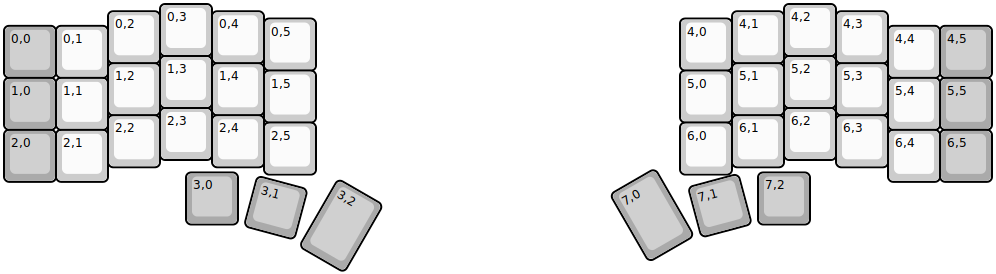
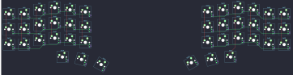

## controllerworks/mini42

[layout](mini42-kle.json) - [PCB](mini42.kicad_pcb)

{:loading="lazy"}

[Open in keyboard-layout-editor](http://www.keyboard-layout-editor.com/##@@_x:3;&=0,3&_x:11;&=4,2;&@_x:2&y:-0.86;&=0,2&_x:1;&=0,4&_x:9;&=4,1&_x:1;&=4,3;&@_x:5&y:-0.86;&=0,5&_x:7;&=4,0;&@_y:-0.86&c=#aaaaaa;&=0,0&_c=#cccccc;&=0,1&_x:15;&=4,4&_c=#aaaaaa;&=4,5;&@_x:3&y:-0.42&c=#cccccc;&=1,3&_x:11;&=5,2;&@_x:2&y:-0.86;&=1,2&_x:1;&=1,4&_x:9;&=5,1&_x:1;&=5,3;&@_x:5&y:-0.86;&=1,5&_x:7;&=5,0;&@_y:-0.86&c=#aaaaaa;&=1,0&_c=#cccccc;&=1,1&_x:15;&=5,4&_c=#aaaaaa;&=5,5;&@_x:3&y:-0.42&c=#cccccc;&=2,3&_x:11;&=6,2;&@_x:2&y:-0.86;&=2,2&_x:1;&=2,4&_x:9;&=6,1&_x:1;&=6,3;&@_x:5&y:-0.86;&=2,5&_x:7;&=6,0;&@_y:-0.86&c=#aaaaaa;&=2,0&_c=#cccccc;&=2,1&_x:15;&=6,4&_c=#aaaaaa;&=6,5;&@_x:3.5&y:-0.18;&=3,0&_x:10.0;&=7,2;&@_r:15&rx:5.25&ry:3.9&x:-0.5&y:-0.5;&=3,1;&@_r:30&rx:6.75&ry:4.36&x:-0.75&y:-0.75&h:1.5;&=3,2;&@_r:-30&rx:12&y:-0.75&h:1.5;&=7,0;&@_r:-15&rx:13.75&ry:3.9&x:-0.5&y:-0.5;&=7,1)

{:loading="lazy"}

