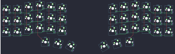

## crkbd/crkbd

[layout](crkbd-kle.json) - [PCB](crkbd.kicad_pcb)

{:loading="lazy"}

[Open in keyboard-layout-editor](http://www.keyboard-layout-editor.com/##@@_x:3.5&y:1;&=0,3&_x:7.5;&=4,3;&@_x:2.5&y:-0.875;&=0,2&_x:1.0;&=0,4&_x:5.5;&=4,4&_x:1.0;&=4,2;&@_x:5.5&y:-0.875;&=0,5&_x:3.5;&=4,5;&@_x:0.5&y:-0.875;&=0,0&=0,1&_x:11.5;&=4,1&=4,0;&@_x:3.5&y:-0.375;&=1,3&_x:7.5;&=5,3;&@_x:2.5&y:-0.875;&=1,2&_x:1.0;&=1,4&_x:5.5;&=5,4&_x:1.0;&=5,2;&@_x:5.5&y:-0.875;&=1,5&_x:3.5;&=5,5;&@_x:0.5&y:-0.875;&=1,0&=1,1&_x:11.5;&=5,1&=5,0;&@_x:3.5&y:-0.375;&=2,3&_x:7.5;&=6,3;&@_x:2.5&y:-0.875;&=2,2&_x:1.0;&=2,4&_x:5.5;&=6,4&_x:1.0;&=6,2;&@_x:5.5&y:-0.875;&=2,5&_x:3.5;&=6,5;&@_x:0.5&y:-0.875;&=2,0&=2,1&_x:11.5;&=6,1&=6,0;&@_x:4&y:-0.125;&=3,3&_x:6.5;&=7,3;&@_r:15&rx:4.5&ry:9.1&x:-0.5&y:-4.85;&=3,4;&@_r:30&rx:5.4&ry:9.3&x:-1.4&y:-5.05&h:1.5;&=3,5;&@_r:-30&rx:11.1&x:0.4&y:-5.05&h:1.5;&=7,5;&@_r:-15&rx:12&ry:9.1&x:-0.5&y:-4.85;&=7,4)

{:loading="lazy"}

