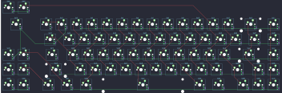

## custommk/evo70

[layout](evo70-kle.json) - [PCB](evo70.kicad_pcb)

{:loading="lazy"}

[Open in keyboard-layout-editor](http://www.keyboard-layout-editor.com/##@@_c=#aaaaaa;&=4,7&=4,10;&@_x:0.5&y:0.1;&=5,6&_x:1.0&c=#777777;&=0,0&_c=#cccccc;&=5,0&=0,1&=0,2&=0,3&=0,4&=0,5&=0,6&=0,7&=0,8&=0,9&=0,10&=0,11&_c=#aaaaaa&w:2;&=0,12&=0,13;&@_x:2.5&w:1.5;&=5,1&_c=#cccccc;&=1,0&=1,1&=1,2&=1,3&=1,4&=1,5&=1,6&=1,7&=1,8&=1,9&=1,10&=1,11&_c=#aaaaaa&w:1.5;&=1,12&=1,13;&@=5,5&=2,0&_x:0.5&w:1.75;&=5,2&_c=#cccccc;&=2,1&=2,2&=2,3&=2,4&=2,5&=2,6&=2,7&=2,8&=2,9&=2,10&=2,11&_c=#777777&w:2.25;&=2,12&_c=#aaaaaa;&=2,13;&@=4,6&=4,4&_x:0.5&w:2.25;&=3,0&_c=#cccccc;&=3,1&=3,2&=3,3&=3,4&=3,5&=3,6&=3,7&=3,8&=3,9&=3,10&_c=#aaaaaa&w:1.75;&=3,11&=3,12&=3,13;&@=4,1&=4,3&_x:0.5&w:1.25;&=5,4&_w:1.25;&=4,0&_w:1.25;&=4,2&_c=#cccccc&w:6.25;&=4,5&_c=#aaaaaa&w:1.25;&=4,8&_w:1.25;&=4,9&_x:0.5;&=4,11&=4,12&=4,13)

{:loading="lazy"}

