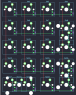

## custommk/genesis_rev1

[layout](genesis_rev1-kle.json) - [PCB](genesis_rev1.kicad_pcb)

{:loading="lazy"}

[Open in keyboard-layout-editor](http://www.keyboard-layout-editor.com/##@@=0,0&=0,1&=0,2&=0,3;&@=1,0&=1,1&=1,2&=1,3%0A%0A%0A0,0;&@=2,0&=2,1&=2,2&=2,3%0A%0A%0A0,0;&@=3,0&=3,1&=3,2&=3,3%0A%0A%0A1,0;&@=4,0%0A%0A%0A2,0&=4,1%0A%0A%0A2,0&=4,2&_c=#777777;&=4,3%0A%0A%0A1,0;&@_x:4.5&y:-4&c=#cccccc&h:2;&=2,3%0A%0A%0A0,1;&@_x:4.5&y:1&c=#777777&h:2;&=4,3%0A%0A%0A1,1;&@_y:1.5&c=#cccccc&w:2;&=4,0%0A%0A%0A2,1)

{:loading="lazy"}

