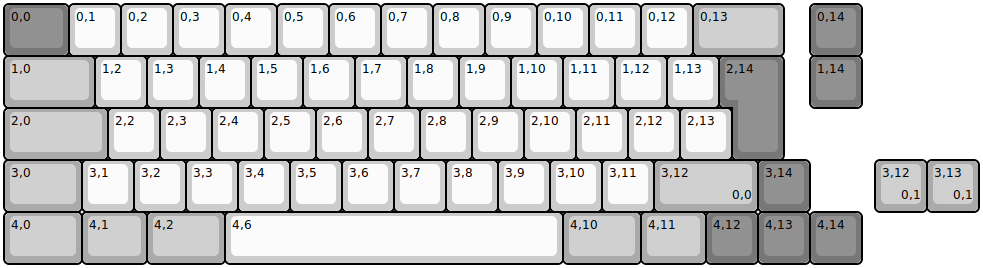
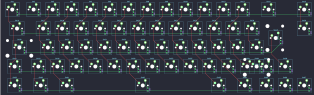

## cutie_club/borsdorf

[layout](borsdorf-kle.json) - [PCB](borsdorf.kicad_pcb)

{:loading="lazy"}

[Open in keyboard-layout-editor](http://www.keyboard-layout-editor.com/##@@_c=#777777&w:1.25;&=0,0&_c=#cccccc;&=0,1&=0,2&=0,3&=0,4&=0,5&=0,6&=0,7&=0,8&=0,9&=0,10&=0,11&=0,12&_c=#aaaaaa&w:1.75;&=0,13&_x:0.5&c=#777777;&=0,14;&@_c=#aaaaaa&w:1.75;&=1,0&_c=#cccccc;&=1,2&=1,3&=1,4&=1,5&=1,6&=1,7&=1,8&=1,9&=1,10&=1,11&=1,12&=1,13&_x:0.25&c=#777777&h:2&h2:1&x2:-0.25;&=2,14&_x:0.5;&=1,14;&@_c=#aaaaaa&w:2;&=2,0&_c=#cccccc;&=2,2&=2,3&=2,4&=2,5&=2,6&=2,7&=2,8&=2,9&=2,10&=2,11&=2,12&=2,13;&@_c=#aaaaaa&w:1.5;&=3,0&_c=#cccccc;&=3,1&=3,2&=3,3&=3,4&=3,5&=3,6&=3,7&=3,8&=3,9&=3,10&=3,11&_c=#aaaaaa&w:2;&=3,12%0A%0A%0A0,0&_c=#777777;&=3,14;&@_c=#aaaaaa&w:1.5;&=4,0&_w:1.25;&=4,1&_w:1.5;&=4,2&_c=#cccccc&w:6.5;&=4,6&_c=#aaaaaa&w:1.5;&=4,10&_w:1.25;&=4,11&_c=#777777;&=4,12&=4,13&=4,14;&@_x:16.75&y:-2&c=#aaaaaa;&=3,12%0A%0A%0A0,1&=3,13%0A%0A%0A0,1)

{:loading="lazy"}

