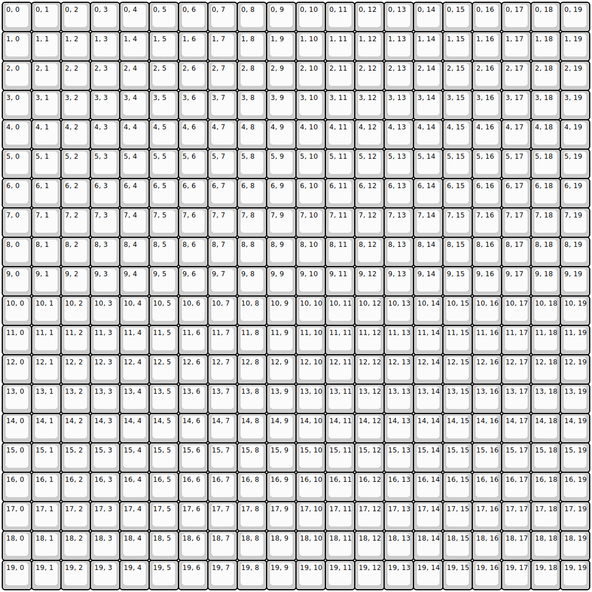

## cutie_club/giant_macro_pad

[layout](giant_macro_pad-kle.json) - [PCB](giant_macro_pad.kicad_pcb)

{:loading="lazy"}

[Open in keyboard-layout-editor](http://www.keyboard-layout-editor.com/##@@=0,%200&=0,%201&=0,%202&=0,%203&=0,%204&=0,%205&=0,%206&=0,%207&=0,%208&=0,%209&=0,%2010&=0,%2011&=0,%2012&=0,%2013&=0,%2014&=0,%2015&=0,%2016&=0,%2017&=0,%2018&=0,%2019;&@=1,%200&=1,%201&=1,%202&=1,%203&=1,%204&=1,%205&=1,%206&=1,%207&=1,%208&=1,%209&=1,%2010&=1,%2011&=1,%2012&=1,%2013&=1,%2014&=1,%2015&=1,%2016&=1,%2017&=1,%2018&=1,%2019;&@=2,%200&=2,%201&=2,%202&=2,%203&=2,%204&=2,%205&=2,%206&=2,%207&=2,%208&=2,%209&=2,%2010&=2,%2011&=2,%2012&=2,%2013&=2,%2014&=2,%2015&=2,%2016&=2,%2017&=2,%2018&=2,%2019;&@=3,%200&=3,%201&=3,%202&=3,%203&=3,%204&=3,%205&=3,%206&=3,%207&=3,%208&=3,%209&=3,%2010&=3,%2011&=3,%2012&=3,%2013&=3,%2014&=3,%2015&=3,%2016&=3,%2017&=3,%2018&=3,%2019;&@=4,%200&=4,%201&=4,%202&=4,%203&=4,%204&=4,%205&=4,%206&=4,%207&=4,%208&=4,%209&=4,%2010&=4,%2011&=4,%2012&=4,%2013&=4,%2014&=4,%2015&=4,%2016&=4,%2017&=4,%2018&=4,%2019;&@=5,%200&=5,%201&=5,%202&=5,%203&=5,%204&=5,%205&=5,%206&=5,%207&=5,%208&=5,%209&=5,%2010&=5,%2011&=5,%2012&=5,%2013&=5,%2014&=5,%2015&=5,%2016&=5,%2017&=5,%2018&=5,%2019;&@=6,%200&=6,%201&=6,%202&=6,%203&=6,%204&=6,%205&=6,%206&=6,%207&=6,%208&=6,%209&=6,%2010&=6,%2011&=6,%2012&=6,%2013&=6,%2014&=6,%2015&=6,%2016&=6,%2017&=6,%2018&=6,%2019;&@=7,%200&=7,%201&=7,%202&=7,%203&=7,%204&=7,%205&=7,%206&=7,%207&=7,%208&=7,%209&=7,%2010&=7,%2011&=7,%2012&=7,%2013&=7,%2014&=7,%2015&=7,%2016&=7,%2017&=7,%2018&=7,%2019;&@=8,%200&=8,%201&=8,%202&=8,%203&=8,%204&=8,%205&=8,%206&=8,%207&=8,%208&=8,%209&=8,%2010&=8,%2011&=8,%2012&=8,%2013&=8,%2014&=8,%2015&=8,%2016&=8,%2017&=8,%2018&=8,%2019;&@=9,%200&=9,%201&=9,%202&=9,%203&=9,%204&=9,%205&=9,%206&=9,%207&=9,%208&=9,%209&=9,%2010&=9,%2011&=9,%2012&=9,%2013&=9,%2014&=9,%2015&=9,%2016&=9,%2017&=9,%2018&=9,%2019;&@=10,%200&=10,%201&=10,%202&=10,%203&=10,%204&=10,%205&=10,%206&=10,%207&=10,%208&=10,%209&=10,%2010&=10,%2011&=10,%2012&=10,%2013&=10,%2014&=10,%2015&=10,%2016&=10,%2017&=10,%2018&=10,%2019;&@=11,%200&=11,%201&=11,%202&=11,%203&=11,%204&=11,%205&=11,%206&=11,%207&=11,%208&=11,%209&=11,%2010&=11,%2011&=11,%2012&=11,%2013&=11,%2014&=11,%2015&=11,%2016&=11,%2017&=11,%2018&=11,%2019;&@=12,%200&=12,%201&=12,%202&=12,%203&=12,%204&=12,%205&=12,%206&=12,%207&=12,%208&=12,%209&=12,%2010&=12,%2011&=12,%2012&=12,%2013&=12,%2014&=12,%2015&=12,%2016&=12,%2017&=12,%2018&=12,%2019;&@=13,%200&=13,%201&=13,%202&=13,%203&=13,%204&=13,%205&=13,%206&=13,%207&=13,%208&=13,%209&=13,%2010&=13,%2011&=13,%2012&=13,%2013&=13,%2014&=13,%2015&=13,%2016&=13,%2017&=13,%2018&=13,%2019;&@=14,%200&=14,%201&=14,%202&=14,%203&=14,%204&=14,%205&=14,%206&=14,%207&=14,%208&=14,%209&=14,%2010&=14,%2011&=14,%2012&=14,%2013&=14,%2014&=14,%2015&=14,%2016&=14,%2017&=14,%2018&=14,%2019;&@=15,%200&=15,%201&=15,%202&=15,%203&=15,%204&=15,%205&=15,%206&=15,%207&=15,%208&=15,%209&=15,%2010&=15,%2011&=15,%2012&=15,%2013&=15,%2014&=15,%2015&=15,%2016&=15,%2017&=15,%2018&=15,%2019;&@=16,%200&=16,%201&=16,%202&=16,%203&=16,%204&=16,%205&=16,%206&=16,%207&=16,%208&=16,%209&=16,%2010&=16,%2011&=16,%2012&=16,%2013&=16,%2014&=16,%2015&=16,%2016&=16,%2017&=16,%2018&=16,%2019;&@=17,%200&=17,%201&=17,%202&=17,%203&=17,%204&=17,%205&=17,%206&=17,%207&=17,%208&=17,%209&=17,%2010&=17,%2011&=17,%2012&=17,%2013&=17,%2014&=17,%2015&=17,%2016&=17,%2017&=17,%2018&=17,%2019;&@=18,%200&=18,%201&=18,%202&=18,%203&=18,%204&=18,%205&=18,%206&=18,%207&=18,%208&=18,%209&=18,%2010&=18,%2011&=18,%2012&=18,%2013&=18,%2014&=18,%2015&=18,%2016&=18,%2017&=18,%2018&=18,%2019;&@=19,%200&=19,%201&=19,%202&=19,%203&=19,%204&=19,%205&=19,%206&=19,%207&=19,%208&=19,%209&=19,%2010&=19,%2011&=19,%2012&=19,%2013&=19,%2014&=19,%2015&=19,%2016&=19,%2017&=19,%2018&=19,%2019)

{:loading="lazy"}

