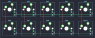

## cybergear/macro25/mkmacro01

[layout](mkmacro01-kle.json) - [PCB](mkmacro01.kicad_pcb)

{:loading="lazy"}

[Open in keyboard-layout-editor](http://www.keyboard-layout-editor.com/##@@=0,0&=0,1&=0,2&=0,3&=0,4;&@=1,0&=1,1&=1,2&=1,3&=1,4)

{:loading="lazy"}

