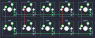
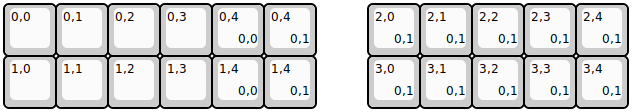
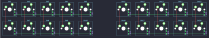

## dailycraft/sandbox/sandbox_rev1

[layout](sandbox_rev1-kle.json) - [PCB](sandbox_rev1.kicad_pcb)

{:loading="lazy"}

[Open in keyboard-layout-editor](http://www.keyboard-layout-editor.com/##@@=0,0&=0,1&=0,2&=0,3&=0,4;&@=1,0&=1,1&=1,2&=1,3&=1,4)

{:loading="lazy"}

## dailycraft/sandbox/sandbox_rev2

[layout](sandbox_rev2-kle.json) - [PCB](sandbox_rev2.kicad_pcb)

{:loading="lazy"}

[Open in keyboard-layout-editor](http://www.keyboard-layout-editor.com/##@@=0,0&=0,1&=0,2&=0,3&=0,4%0A%0A%0A0,0;&@=1,0&=1,1&=1,2&=1,3&=1,4%0A%0A%0A0,0;&@_x:5&y:-2;&=0,4%0A%0A%0A0,1&_x:1;&=2,0%0A%0A%0A0,1&=2,1%0A%0A%0A0,1&=2,2%0A%0A%0A0,1&=2,3%0A%0A%0A0,1&=2,4%0A%0A%0A0,1;&@_x:5;&=1,4%0A%0A%0A0,1&_x:1;&=3,0%0A%0A%0A0,1&=3,1%0A%0A%0A0,1&=3,2%0A%0A%0A0,1&=3,3%0A%0A%0A0,1&=3,4%0A%0A%0A0,1)

{:loading="lazy"}

