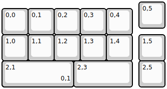
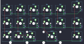

## damapad/damapad

[layout](damapad-kle.json) - [PCB](damapad.kicad_pcb)

{:loading="lazy"}

[Open in keyboard-layout-editor](http://www.keyboard-layout-editor.com/##@@_x:5.25;&=0,5;&@_y:-0.75;&=0,0&=0,1&=0,2&=0,3&=0,4;&@=1,0&=1,1&=1,2&=1,3&=1,4&_x:0.25;&=1,5;&@=2,0%0A%0A%0A0,0&_x:0.75;&=2,1%0A%0A%0A0,0&_w:2.25;&=2,3&_x:0.25;&=2,5&_x:-6.25&w:2.75;&=2,1%0A%0A%0A0,1)

{:loading="lazy"}

