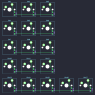

## dekunukem/duckypad

[layout](duckypad-kle.json) - [PCB](duckypad.kicad_pcb)

{:loading="lazy"}

[Open in keyboard-layout-editor](http://www.keyboard-layout-editor.com/##@@=0,0&=0,1&=0,2;&@=0,3&=0,4&=0,5;&@=0,6&=0,7&=0,8;&@=0,9&=0,10&=0,11;&@=0,12&=0,13&=0,14&=0,15&=0,16)

{:loading="lazy"}

