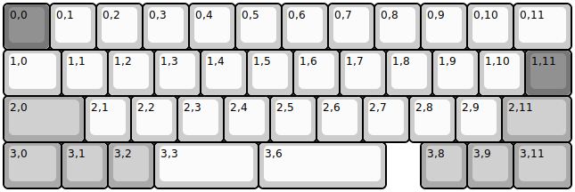
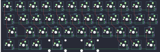

## delilah/delilah

[layout](delilah-kle.json) - [PCB](delilah.kicad_pcb)

{:loading="lazy"}

[Open in keyboard-layout-editor](http://www.keyboard-layout-editor.com/##@@_c=#777777;&=0,0&_c=#cccccc;&=0,1&=0,2&=0,3&=0,4&=0,5&=0,6&=0,7&=0,8&=0,9&=0,10&_w:1.25;&=0,11;&@_w:1.25;&=1,0&=1,1&=1,2&=1,3&=1,4&=1,5&=1,6&=1,7&=1,8&=1,9&=1,10&_c=#777777;&=1,11;&@_c=#aaaaaa&w:1.75;&=2,0&_c=#cccccc;&=2,1&=2,2&=2,3&=2,4&=2,5&=2,6&=2,7&=2,8&=2,9&_c=#aaaaaa&w:1.5;&=2,11;&@_w:1.25;&=3,0&=3,1&=3,2&_c=#cccccc&w:2.25;&=3,3&_w:2.75;&=3,6&_x:0.75&c=#aaaaaa;&=3,8&=3,9&_w:1.25;&=3,11)

{:loading="lazy"}

