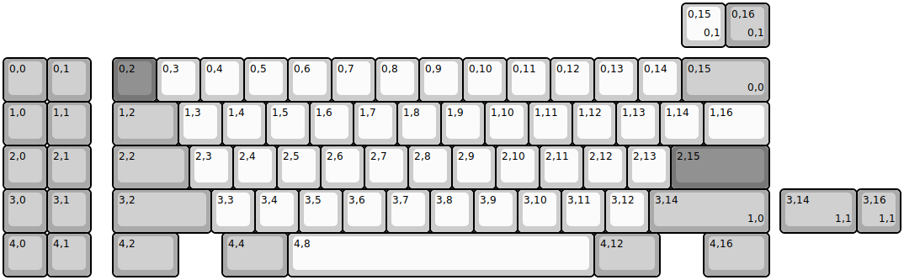
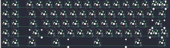

## demiurge/demiurge

[layout](demiurge-kle.json) - [PCB](demiurge.kicad_pcb)

{:loading="lazy"}

[Open in keyboard-layout-editor](http://www.keyboard-layout-editor.com/##@@_y:1.25&c=#aaaaaa;&=0,0&=0,1&_x:0.5&c=#777777;&=0,2&_c=#cccccc;&=0,3&=0,4&=0,5&=0,6&=0,7&=0,8&=0,9&=0,10&=0,11&=0,12&=0,13&=0,14&_c=#aaaaaa&w:2;&=0,15%0A%0A%0A0,0;&@=1,0&=1,1&_x:0.5&w:1.5;&=1,2&_c=#cccccc;&=1,3&=1,4&=1,5&=1,6&=1,7&=1,8&=1,9&=1,10&=1,11&=1,12&=1,13&=1,14&_w:1.5;&=1,16;&@_c=#aaaaaa;&=2,0&=2,1&_x:0.5&w:1.75;&=2,2&_c=#cccccc;&=2,3&=2,4&=2,5&=2,6&=2,7&=2,8&=2,9&=2,10&=2,11&=2,12&=2,13&_c=#777777&w:2.25;&=2,15;&@_c=#aaaaaa;&=3,0&=3,1&_x:0.5&w:2.25;&=3,2&_c=#cccccc;&=3,3&=3,4&=3,5&=3,6&=3,7&=3,8&=3,9&=3,10&=3,11&=3,12&_c=#aaaaaa&w:2.75;&=3,14%0A%0A%0A1,0;&@=4,0&=4,1&_x:0.5&w:1.5;&=4,2&_x:1.0&w:1.5;&=4,4&_c=#cccccc&w:7;&=4,8&_c=#aaaaaa&w:1.5;&=4,12&_x:1.0&w:1.5;&=4,16;&@_x:15.5&y:-6.25&c=#cccccc;&=0,15%0A%0A%0A0,1&_c=#aaaaaa;&=0,16%0A%0A%0A0,1;&@_x:17.75&y:3.25&w:1.75;&=3,14%0A%0A%0A1,1&=3,16%0A%0A%0A1,1)

{:loading="lazy"}

