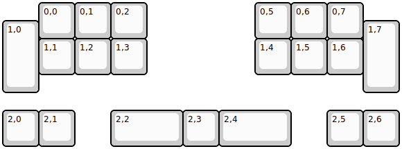
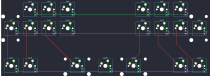

## deng/djam

[layout](djam-kle.json) - [PCB](djam.kicad_pcb)

{:loading="lazy"}

[Open in keyboard-layout-editor](http://www.keyboard-layout-editor.com/##@@_x:1;&=0,0&=0,1&=0,2&_x:3;&=0,5&=0,6&=0,7;&@_y:-0.5&h:2;&=1,0;&@_x:1&y:-0.5;&=1,1&=1,2&=1,3&_x:3;&=1,4&=1,5&=1,6;&@_x:10&y:-1.5&h:2;&=1,7;&@_y:1.5;&=2,0&=2,1&_x:1&w:2;&=2,2&=2,3&_w:2;&=2,4&_x:1;&=2,5&=2,6)

{:loading="lazy"}

