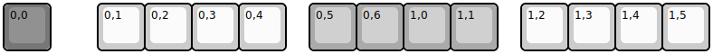

## dinofizz/fnrow/fnrow_v1

[layout](fnrow_v1-kle.json) - [PCB](fnrow_v1.kicad_pcb)

{:loading="lazy"}

[Open in keyboard-layout-editor](http://www.keyboard-layout-editor.com/##@@_c=#777777;&=0,0&_x:1&c=#cccccc;&=0,1&=0,2&=0,3&=0,4&_x:0.5&c=#aaaaaa;&=0,5&=0,6&=1,0&=1,1&_x:0.5&c=#cccccc;&=1,2&=1,3&=1,4&=1,5)

{:loading="lazy"}

