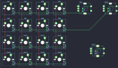

## doio/kb16/kb16-01

[layout](kb16-01-kle.json) - [PCB](kb16-01.kicad_pcb)

{:loading="lazy"}

[Open in keyboard-layout-editor](http://www.keyboard-layout-editor.com/##@@=0,0&=0,1&=0,2&=0,3&_x:0.5;&=0,4%0A%0A%0A%0A%0A%0A%0A%0A%0Ae0&_x:0.5;&=1,4%0A%0A%0A%0A%0A%0A%0A%0A%0Ae1;&@=1,0&=1,1&=1,2&=1,3;&@=2,0&=2,1&=2,2&=2,3&_x:0.75&w:2&h:2;&=2,4%0A%0A%0A%0A%0A%0A%0A%0A%0Ae2;&@=3,0&=3,1&=3,2&=3,3)

{:loading="lazy"}

