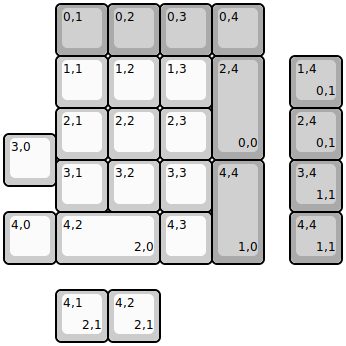
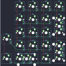

## doodboard/duckboard_r2

[layout](duckboard_r2-kle.json) - [PCB](duckboard_r2.kicad_pcb)

{:loading="lazy"}

[Open in keyboard-layout-editor](http://www.keyboard-layout-editor.com/##@@_x:1&c=#aaaaaa;&=0,1&=0,2&=0,3&=0,4;&@_x:1&c=#cccccc;&=1,1&=1,2&=1,3&_c=#aaaaaa&h:2;&=2,4%0A%0A%0A0,0;&@_x:1&c=#cccccc;&=2,1&=2,2&=2,3;&@_y:-0.5;&=3,0;&@_x:1&y:-0.5;&=3,1&=3,2&=3,3&_c=#aaaaaa&h:2;&=4,4%0A%0A%0A1,0;&@_c=#cccccc;&=4,0&_w:2;&=4,2%0A%0A%0A2,0&=4,3;&@_x:5.5&y:-4.0&c=#aaaaaa;&=1,4%0A%0A%0A0,1;&@_x:5.5;&=2,4%0A%0A%0A0,1;&@_x:5.5;&=3,4%0A%0A%0A1,1;&@_x:5.5;&=4,4%0A%0A%0A1,1;&@_x:1&y:0.5&c=#cccccc;&=4,1%0A%0A%0A2,1&=4,2%0A%0A%0A2,1)

{:loading="lazy"}

