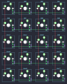

## drewkeys/soy20

[layout](soy20-kle.json) - [PCB](soy20.kicad_pcb)

{:loading="lazy"}

[Open in keyboard-layout-editor](http://www.keyboard-layout-editor.com/##@@=0,3&=0,2&=0,1&=0,0;&@=1,3&=1,2&=1,1&=1,0;&@=2,3&=2,2&=2,1&=2,0;&@=3,3&=3,2&=3,1&=3,0;&@=4,3&=4,2&=4,1&=4,0)

{:loading="lazy"}

