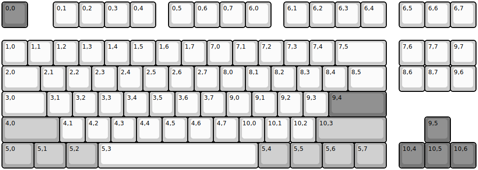
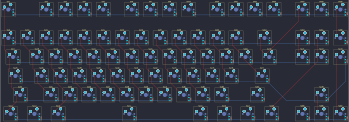

## drop/ctrl

[layout](ctrl-kle.json) - [PCB](ctrl.kicad_pcb)

{:loading="lazy"}

[Open in keyboard-layout-editor](http://www.keyboard-layout-editor.com/##@@_c=#777777;&=0,0&_x:1&c=#cccccc;&=0,1&=0,2&=0,3&=0,4&_x:0.5;&=0,5&=0,6&=0,7&=6,0&_x:0.5;&=6,1&=6,2&=6,3&=6,4&_x:0.5;&=6,5&=6,6&=6,7;&@_y:0.5;&=1,0&=1,1&=1,2&=1,3&=1,4&=1,5&=1,6&=1,7&=7,0&=7,1&=7,2&=7,3&=7,4&_w:2;&=7,5&_x:0.5;&=7,6&=7,7&=9,7;&@_w:1.5;&=2,0&=2,1&=2,2&=2,3&=2,4&=2,5&=2,6&=2,7&=8,0&=8,1&=8,2&=8,3&=8,4&_w:1.5;&=8,5&_x:0.5;&=8,6&=8,7&=9,6;&@_w:1.75;&=3,0&=3,1&=3,2&=3,3&=3,4&=3,5&=3,6&=3,7&=9,0&=9,1&=9,2&=9,3&_c=#777777&w:2.25;&=9,4;&@_c=#aaaaaa&w:2.25;&=4,0&_c=#cccccc;&=4,1&=4,2&=4,3&=4,4&=4,5&=4,6&=4,7&=10,0&=10,1&=10,2&_c=#aaaaaa&w:2.75;&=10,3&_x:1.5&c=#777777;&=9,5;&@_c=#aaaaaa&w:1.25;&=5,0&_w:1.25;&=5,1&_w:1.25;&=5,2&_c=#cccccc&w:6.25;&=5,3&_c=#aaaaaa&w:1.25;&=5,4&_w:1.25;&=5,5&_w:1.25;&=5,6&_w:1.25;&=5,7&_x:0.5&c=#777777;&=10,4&=10,5&=10,6)

{:loading="lazy"}

