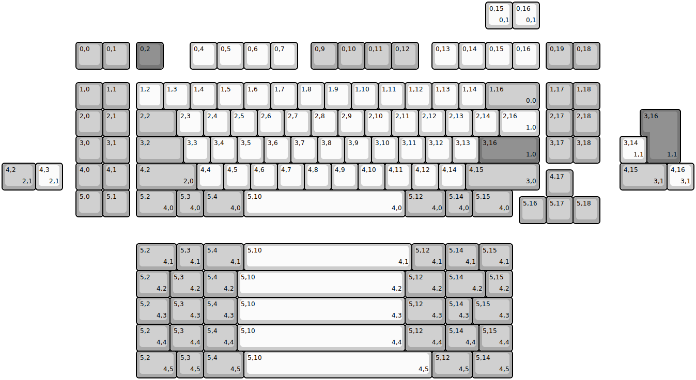
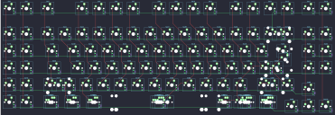

## duck/tcv3

[layout](tcv3-kle.json) - [PCB](tcv3.kicad_pcb)

{:loading="lazy"}

[Open in keyboard-layout-editor](http://www.keyboard-layout-editor.com/##@@_x:2.75&y:1.5&c=#aaaaaa;&=0,0&=0,1&_x:0.25&c=#777777;&=0,2&_x:1.0&c=#cccccc;&=0,4&=0,5&=0,6&=0,7&_x:0.5&c=#aaaaaa;&=0,9&=0,10&=0,11&=0,12&_x:0.5&c=#cccccc;&=0,13&=0,14&=0,15&=0,16&_x:0.25&c=#aaaaaa;&=0,19&=0,18;&@_x:2.75&y:0.5;&=1,0&=1,1&_x:0.25&c=#cccccc;&=1,2&=1,3&=1,4&=1,5&=1,6&=1,7&=1,8&=1,9&=1,10&=1,11&=1,12&=1,13&=1,14&_c=#aaaaaa&w:2;&=1,16%0A%0A%0A0,0&_x:0.25;&=1,17&=1,18;&@_x:2.75;&=2,0&=2,1&_x:0.25&w:1.5;&=2,2&_c=#cccccc;&=2,3&=2,4&=2,5&=2,6&=2,7&=2,8&=2,9&=2,10&=2,11&=2,12&=2,13&=2,14&_w:1.5;&=2,16%0A%0A%0A1,0&_x:0.25&c=#aaaaaa;&=2,17&=2,18;&@_x:2.75;&=3,0&=3,1&_x:0.25&w:1.75;&=3,2&_c=#cccccc;&=3,3&=3,4&=3,5&=3,6&=3,7&=3,8&=3,9&=3,10&=3,11&=3,12&=3,13&_c=#777777&w:2.25;&=3,16%0A%0A%0A1,0&_x:0.25&c=#aaaaaa;&=3,17&=3,18;&@_x:2.75;&=4,0&=4,1&_x:0.25&w:2.25;&=4,2%0A%0A%0A2,0&_c=#cccccc;&=4,4&=4,5&=4,6&=4,7&=4,8&=4,9&=4,10&=4,11&=4,12&=4,14&_c=#aaaaaa&w:2.75;&=4,15%0A%0A%0A3,0;&@_x:20.25&y:-0.75;&=4,17;&@_x:2.75&y:-0.25;&=5,0&=5,1&_x:0.25&w:1.5;&=5,2%0A%0A%0A4,0&=5,3%0A%0A%0A4,0&_w:1.5;&=5,4%0A%0A%0A4,0&_c=#cccccc&w:6;&=5,10%0A%0A%0A4,0&_c=#aaaaaa&w:1.5;&=5,12%0A%0A%0A4,0&=5,14%0A%0A%0A4,0&_w:1.5;&=5,15%0A%0A%0A4,0;&@_x:19.25&y:-0.75;&=5,16&=5,17&=5,18;&@_x:18&y:-8.25&c=#cccccc;&=0,15%0A%0A%0A0,1&=0,16%0A%0A%0A0,1;&@_x:24.0&y:3.0&c=#777777&w:1.25&h:2&w2:1.5&h2:1&x2:-0.25;&=3,16%0A%0A%0A1,1;&@_x:23.0&c=#cccccc;&=3,14%0A%0A%0A1,1;&@_c=#aaaaaa&w:1.25;&=4,2%0A%0A%0A2,1&_c=#cccccc;&=4,3%0A%0A%0A2,1&_x:20.75&c=#aaaaaa&w:1.75;&=4,15%0A%0A%0A3,1&_c=#cccccc;&=4,16%0A%0A%0A3,1;&@_x:5&y:2.0&c=#aaaaaa&w:1.5;&=5,2%0A%0A%0A4,1&=5,3%0A%0A%0A4,1&_w:1.5;&=5,4%0A%0A%0A4,1&_c=#cccccc&w:6.25;&=5,10%0A%0A%0A4,1&_c=#aaaaaa&w:1.25;&=5,12%0A%0A%0A4,1&_w:1.25;&=5,14%0A%0A%0A4,1&_w:1.25;&=5,15%0A%0A%0A4,1;&@_x:5&w:1.25;&=5,2%0A%0A%0A4,2&_w:1.25;&=5,3%0A%0A%0A4,2&_w:1.25;&=5,4%0A%0A%0A4,2&_c=#cccccc&w:6.25;&=5,10%0A%0A%0A4,2&_c=#aaaaaa&w:1.5;&=5,12%0A%0A%0A4,2&_w:1.5;&=5,14%0A%0A%0A4,2&=5,15%0A%0A%0A4,2;&@_x:5&w:1.25;&=5,2%0A%0A%0A4,3&_w:1.25;&=5,3%0A%0A%0A4,3&_w:1.25;&=5,4%0A%0A%0A4,3&_c=#cccccc&w:6.25;&=5,10%0A%0A%0A4,3&_c=#aaaaaa&w:1.5;&=5,12%0A%0A%0A4,3&=5,14%0A%0A%0A4,3&_w:1.5;&=5,15%0A%0A%0A4,3;&@_x:5&w:1.25;&=5,2%0A%0A%0A4,4&_w:1.25;&=5,3%0A%0A%0A4,4&_w:1.25;&=5,4%0A%0A%0A4,4&_c=#cccccc&w:6.25;&=5,10%0A%0A%0A4,4&_c=#aaaaaa&w:1.5;&=5,12%0A%0A%0A4,4&_w:1.25;&=5,14%0A%0A%0A4,4&_w:1.25;&=5,15%0A%0A%0A4,4;&@_x:5&w:1.5;&=5,2%0A%0A%0A4,5&=5,3%0A%0A%0A4,5&_w:1.5;&=5,4%0A%0A%0A4,5&_c=#cccccc&w:7;&=5,10%0A%0A%0A4,5&_c=#aaaaaa&w:1.5;&=5,12%0A%0A%0A4,5&_w:1.5;&=5,14%0A%0A%0A4,5)

{:loading="lazy"}

