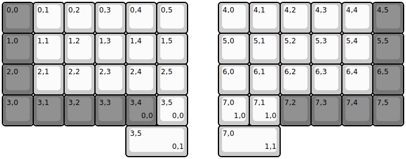
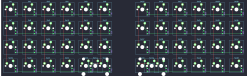

## duckle/vitamins_included

[layout](vitamins_included-kle.json) - [PCB](vitamins_included.kicad_pcb)

{:loading="lazy"}

[Open in keyboard-layout-editor](http://www.keyboard-layout-editor.com/##@@_c=#777777;&=0,0&_c=#cccccc;&=0,1&=0,2&=0,3&=0,4&=0,5&_x:1;&=4,0&=4,1&=4,2&=4,3&=4,4&_c=#777777;&=4,5;&@=1,0&_c=#cccccc;&=1,1&=1,2&=1,3&=1,4&=1,5&_x:1;&=5,0&=5,1&=5,2&=5,3&=5,4&_c=#777777;&=5,5;&@=2,0&_c=#cccccc;&=2,1&=2,2&=2,3&=2,4&=2,5&_x:1;&=6,0&=6,1&=6,2&=6,3&=6,4&_c=#777777;&=6,5;&@=3,0&=3,1&=3,2&=3,3&=3,4%0A%0A%0A0,0&_c=#cccccc;&=3,5%0A%0A%0A0,0&_x:1;&=7,0%0A%0A%0A1,0&=7,1%0A%0A%0A1,0&_c=#777777;&=7,2&=7,3&=7,4&=7,5;&@_x:4&c=#cccccc&w:2;&=3,5%0A%0A%0A0,1&_x:1&w:2;&=7,0%0A%0A%0A1,1)

{:loading="lazy"}

