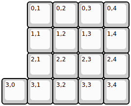
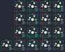

## dumbpad/dumbpad

[layout](dumbpad-kle.json) - [PCB](dumbpad.kicad_pcb)

{:loading="lazy"}

[Open in keyboard-layout-editor](http://www.keyboard-layout-editor.com/##@@_x:1;&=0,1&=0,2&=0,3&=0,4;&@_x:1;&=1,1&=1,2&=1,3&=1,4;&@_x:1;&=2,1&=2,2&=2,3&=2,4;&@=3,0&=3,1&=3,2&=3,3&=3,4)

{:loading="lazy"}

