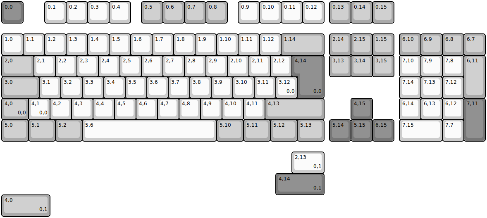
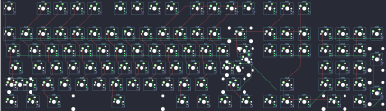

## durgod/k310

[layout](k310-kle.json) - [PCB](k310.kicad_pcb)

{:loading="lazy"}

[Open in keyboard-layout-editor](http://www.keyboard-layout-editor.com/##@@_c=#777777;&=0,0&_x:1&c=#cccccc;&=0,1&=0,2&=0,3&=0,4&_x:0.5&c=#aaaaaa;&=0,5&=0,6&=0,7&=0,8&_x:0.5&c=#cccccc;&=0,9&=0,10&=0,11&=0,12&_x:0.25&c=#aaaaaa;&=0,13&=0,14&=0,15;&@_y:0.5&c=#cccccc;&=1,0&=1,1&=1,2&=1,3&=1,4&=1,5&=1,6&=1,7&=1,8&=1,9&=1,10&=1,11&=1,12&_c=#aaaaaa&w:2;&=1,14&_x:0.25;&=2,14&=2,15&=1,15&_x:0.25;&=6,10&=6,9&=6,8&=6,7;&@_w:1.5;&=2,0&_c=#cccccc;&=2,1&=2,2&=2,3&=2,4&=2,5&=2,6&=2,7&=2,8&=2,9&=2,10&=2,11&=2,12&_x:0.25&c=#777777&w:1.25&h:2&w2:1.5&h2:1&x2:-0.25;&=4,14%0A%0A%0A0,0&_x:0.25&c=#aaaaaa;&=3,13&=3,14&=3,15&_x:0.25&c=#cccccc;&=7,10&=7,9&=7,8&_c=#aaaaaa&h:2;&=6,11;&@_w:1.75;&=3,0&_c=#cccccc;&=3,1&=3,2&=3,3&=3,4&=3,5&=3,6&=3,7&=3,8&=3,9&=3,10&=3,11&=3,12%0A%0A%0A0,0&_x:4.75;&=7,14&=7,13&=7,12;&@_c=#aaaaaa&w:1.25;&=4,0%0A%0A%0A0,0&_c=#cccccc;&=4,1%0A%0A%0A0,0&=4,2&=4,3&=4,4&=4,5&=4,6&=4,7&=4,8&=4,9&=4,10&=4,11&_c=#aaaaaa&w:2.75;&=4,13&_x:1.25&c=#777777;&=4,15&_x:1.25&c=#cccccc;&=6,14&=6,13&=6,12&_c=#777777&h:2;&=7,11;&@_c=#aaaaaa&w:1.25;&=5,0&_w:1.25;&=5,1&_w:1.25;&=5,2&_c=#cccccc&w:6.25;&=5,6&_c=#aaaaaa&w:1.25;&=5,10&_w:1.25;&=5,11&_w:1.25;&=5,12&_w:1.25;&=5,13&_x:0.25&c=#777777;&=5,14&=5,15&=6,15&_x:0.25&c=#cccccc&w:2;&=7,15&=7,7;&@_x:13.5&y:0.5&w:1.5;&=2,13%0A%0A%0A0,1;&@_x:12.75&c=#777777&w:2.25;&=4,14%0A%0A%0A0,1;&@_c=#aaaaaa&w:2.25;&=4,0%0A%0A%0A0,1)

{:loading="lazy"}

