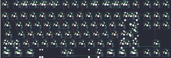
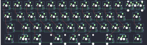
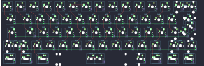
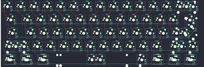
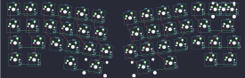
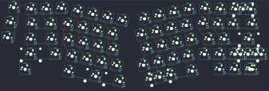

## dyz/dyz.tkl.via

[layout](dyz.tkl.via-kle.json) - [PCB](dyz.tkl.via.kicad_pcb)

{:loading="lazy"}

[Open in keyboard-layout-editor](http://www.keyboard-layout-editor.com/##@@_x:2.5&y:2.25;&=0,0&_x:0.25&w:0.75&d:true;&=%0A%0A%0A0,0&=0,1%0A%0A%0A0,0&=1,1%0A%0A%0A0,0&=0,2%0A%0A%0A0,0&=1,2%0A%0A%0A0,0&_x:0.5;&=0,3%0A%0A%0A0,0&=1,3%0A%0A%0A0,0&=0,4%0A%0A%0A0,0&=1,4%0A%0A%0A0,0&_x:0.5;&=0,5%0A%0A%0A0,0&=0,6%0A%0A%0A0,0&=1,6%0A%0A%0A0,0&=0,7%0A%0A%0A0,0&_x:0.25;&=1,7&=0,8&=1,8;&@_x:2.5&y:0.25;&=2,0&=3,0&=2,1&=3,1&=2,2&=3,2&=2,3&=3,3&=2,4&=3,4&=2,5&=3,5&=2,6&_w:2;&=3,6%0A%0A%0A1,0&_x:0.25;&=3,7&=2,8&=3,8;&@_x:2.5&w:1.5;&=4,0&=5,0&=4,1&=5,1&=4,2&=5,2&=5,3&=4,4&=5,4&=4,5&=5,5&=4,6&=5,6&_w:1.5;&=4,7%0A%0A%0A2,0&_x:0.25;&=5,7&=4,8&=5,8;&@_x:2.5&w:1.75;&=6,0&=7,0&=6,1&=7,1&=6,2&=7,2&=7,3&=6,4&=7,4&=6,5&=7,5&=6,6&_w:2.25;&=7,6%0A%0A%0A2,0;&@_x:2.5&w:2.25;&=8,0%0A%0A%0A3,0&=8,1&=9,1&=8,2&=9,2&=9,3&=8,4&=9,4&=8,5&=9,5&=8,6&_w:2.75;&=9,6%0A%0A%0A4,0&_x:1.25;&=8,8;&@_x:2.5&w:1.25;&=10,0%0A%0A%0A5,0&_w:1.25;&=11,0%0A%0A%0A5,0&_w:1.25;&=10,1%0A%0A%0A5,0&_w:6.25;&=11,3%0A%0A%0A5,0&_w:1.25;&=11,5%0A%0A%0A5,0&_w:1.25;&=10,6%0A%0A%0A5,0&_w:1.25;&=11,6%0A%0A%0A5,0&_w:1.25;&=10,7%0A%0A%0A5,0&_x:0.25;&=11,7&=10,8&=11,8;&@_x:3.75&y:-7.5;&=1,0%0A%0A%0A0,1&=0,1%0A%0A%0A0,1&=1,1%0A%0A%0A0,1&=0,2%0A%0A%0A0,1&_x:0.25;&=1,2%0A%0A%0A0,1&=0,3%0A%0A%0A0,1&=1,3%0A%0A%0A0,1&=0,4%0A%0A%0A0,1&_x:0.25;&=1,4%0A%0A%0A0,1&=0,5%0A%0A%0A0,1&=0,6%0A%0A%0A0,1&=1,6%0A%0A%0A0,1&_x:0.25;&=0,7%0A%0A%0A0,1;&@_x:21.5&y:1.5;&=3,6%0A%0A%0A1,1&=2,7%0A%0A%0A1,1;&@_x:22.25&w:1.25&h:2&w2:1.5&h2:1&x2:-0.25;&=6,7%0A%0A%0A2,1;&@_x:21.25;&=7,6%0A%0A%0A2,1;&@_w:1.25;&=8,0%0A%0A%0A3,1&=9,0%0A%0A%0A3,1&_x:18.5&w:1.75;&=9,6%0A%0A%0A4,1&=8,7%0A%0A%0A4,1;&@_x:2.5&y:1.25&w:1.5;&=10,0%0A%0A%0A5,1&=11,0%0A%0A%0A5,1&_w:1.5;&=10,1%0A%0A%0A5,1&_w:7;&=11,3%0A%0A%0A5,1&_w:1.5;&=10,6%0A%0A%0A5,1&=11,6%0A%0A%0A5,1&_w:1.5;&=10,7%0A%0A%0A5,1)

{:loading="lazy"}

## dyz/dyz40.via

[layout](dyz40.via-kle.json) - [PCB](dyz40.via.kicad_pcb)

{:loading="lazy"}

[Open in keyboard-layout-editor](http://www.keyboard-layout-editor.com/##@@_y:1.25;&=0,0&=0,1&=0,2&=0,3&=0,4&=0,5&=0,6&=0,7&=0,8&=0,9&=0,10&=0,11%0A%0A%0A0,0&=0,12%0A%0A%0A0,0;&@_w:1.25;&=1,0&=1,1&=1,2&=1,3&=1,4&=1,5&=1,6&=1,7&=1,8&=1,9&=1,10%0A%0A%0A%0A%0A%0A%0A%0A%0A%0A'&_w:1.75;&=1,11;&@_w:1.75;&=2,0&=2,1&=2,2&=2,3&=2,4&=2,5&=2,6&=2,7&=2,8&=2,9&=2,10&_w:1.25;&=2,11;&@_w:1.5;&=3,0%0A%0A%0A1,0&=3,1%0A%0A%0A1,0&_w:1.5;&=3,2%0A%0A%0A1,0&_w:2.25;&=3,3%0A%0A%0A1,0&_w:2.75;&=3,7%0A%0A%0A1,0&_w:1.5;&=3,10%0A%0A%0A1,0&=3,11%0A%0A%0A1,0&_w:1.5;&=3,12%0A%0A%0A1,0;&@_x:11&y:-5.25&w:2;&=0,11%0A%0A%0A0,1;&@_y:4.75&w:1.5;&=3,0%0A%0A%0A1,1&_w:1.5;&=3,1%0A%0A%0A1,1&_w:7;&=3,6%0A%0A%0A1,1&_w:1.5;&=3,11%0A%0A%0A1,1&_w:1.5;&=3,12%0A%0A%0A1,1)

{:loading="lazy"}

## dyz/dyz60-hs

[layout](dyz60-hs-kle.json) - [PCB](dyz60-hs.kicad_pcb)

{:loading="lazy"}

[Open in keyboard-layout-editor](http://www.keyboard-layout-editor.com/##@@_y:1.25;&=0,0&=0,1&=0,2&=0,3&=0,4&=0,5&=4,5&=0,6&=0,7&=0,8&=0,9&=0,10&=0,11&=0,12%0A%0A%0A0,0&=0,13%0A%0A%0A0,0;&@_w:1.5;&=1,0&=1,1&=1,2&=1,3&=1,4&=1,5&=1,6&=1,7&=1,8&=1,9&=1,10&=1,11&=1,12&_w:1.5;&=1,13%0A%0A%0A1,0;&@_w:1.75;&=2,0&=2,1&=2,2&=2,3&=2,4&=2,5&=2,6&=2,7&=2,8&=2,9&=2,10&=2,11&_w:2.25;&=2,12%0A%0A%0A1,0;&@_w:2.25;&=3,0%0A%0A%0A2,0&=3,2&=3,3&=3,4&=3,5&=3,6&=3,7&=3,8&=3,9&=3,10&=3,11&_w:1.75;&=3,12%0A%0A%0A3,0&=3,13%0A%0A%0A3,0;&@_w:1.5;&=4,0%0A%0A%0A4,0&=4,1%0A%0A%0A4,0&_w:1.5;&=4,2%0A%0A%0A4,0&_w:7;&=4,6%0A%0A%0A4,0&_w:1.5;&=4,11%0A%0A%0A4,0&=4,12%0A%0A%0A4,0&_w:1.5;&=4,13%0A%0A%0A4,0;&@_x:13&y:-6.25&w:2;&=0,12%0A%0A%0A0,1;&@_x:16.25&y:1.25&w:1.25&h:2&w2:1.5&h2:1&x2:-0.25;&=2,13%0A%0A%0A1,1;&@_x:15.25;&=2,12%0A%0A%0A1,1;&@_x:15.25&w:2.75;&=3,12%0A%0A%0A3,1;&@_y:1.5&w:1.25;&=4,0%0A%0A%0A4,1&_w:1.25;&=4,1%0A%0A%0A4,1&_w:1.25;&=4,2%0A%0A%0A4,1&_w:6.25;&=4,6%0A%0A%0A4,1&_w:1.25;&=4,10%0A%0A%0A4,1&_w:1.25;&=4,11%0A%0A%0A4,1&_w:1.25;&=4,12%0A%0A%0A4,1&_w:1.25;&=4,13%0A%0A%0A4,1;&@_y:0.25&w:1.25;&=3,0%0A%0A%0A2,1&=3,1%0A%0A%0A2,1)

{:loading="lazy"}

## dyz/dyz60.via

[layout](dyz60.via-kle.json) - [PCB](dyz60.via.kicad_pcb)

{:loading="lazy"}

[Open in keyboard-layout-editor](http://www.keyboard-layout-editor.com/##@_name=dyz60;&@_x:2.75&y:1.25;&=0,0&=0,1&=0,2&=0,3&=0,4&=0,5&=4,5&=0,6&=0,7&=0,8&=0,9&=0,10&=0,11&_w:2;&=0,12%0A%0A%0A0,0;&@_x:2.75&w:1.5;&=1,0&=1,1&=1,2&=1,3&=1,4&=1,5&=1,6&=1,7&=1,8&=1,9&=1,10&=1,11&=1,12&_w:1.5;&=1,13%0A%0A%0A1,0;&@_x:2.75&w:1.75;&=2,0&=2,1&=2,2&=2,3&=2,4&=2,5&=2,6&=2,7&=2,8&=2,9&=2,10&=2,11&_w:2.25;&=2,12%0A%0A%0A1,0;&@_x:2.75&w:2.25;&=3,0%0A%0A%0A2,0&=3,2&=3,3&=3,4&=3,5&=3,6&=3,7&=3,8&=3,9&=3,10&=3,11&_w:1.75;&=3,12%0A%0A%0A3,0&=3,13%0A%0A%0A3,0;&@_x:2.75&w:1.5;&=4,0%0A%0A%0A4,0&=4,1%0A%0A%0A4,0&_w:1.5;&=4,2%0A%0A%0A4,0&_w:7;&=4,6%0A%0A%0A4,0&_w:1.5;&=4,11%0A%0A%0A4,0&=4,12%0A%0A%0A4,0&_w:1.5;&=4,13%0A%0A%0A4,0;&@_x:15.75&y:-6.25;&=0,12%0A%0A%0A0,1&=0,13%0A%0A%0A0,1;&@_x:19.0&y:1.25&w:1.25&h:2&w2:1.5&h2:1&x2:-0.25;&=2,13%0A%0A%0A1,1;&@_x:18.0;&=2,12%0A%0A%0A1,1;&@_x:0.25&w:1.25;&=3,0%0A%0A%0A2,1&=3,1%0A%0A%0A2,1&_x:15.5&w:2.75;&=3,12%0A%0A%0A3,1;&@_x:2.75&y:1.5&w:1.25;&=4,0%0A%0A%0A4,1&_w:1.25;&=4,1%0A%0A%0A4,1&_w:1.25;&=4,2%0A%0A%0A4,1&_w:6.25;&=4,6%0A%0A%0A4,1&_w:1.25;&=4,10%0A%0A%0A4,1&_w:1.25;&=4,11%0A%0A%0A4,1&_w:1.25;&=4,12%0A%0A%0A4,1&_w:1.25;&=4,13%0A%0A%0A4,1)

{:loading="lazy"}

## dyz/selka40.via

[layout](selka40.via-kle.json) - [PCB](selka40.via.kicad_pcb)

{:loading="lazy"}

[Open in keyboard-layout-editor](http://www.keyboard-layout-editor.com/##@@_x:1.03&y:2.45;&=0,0&=0,1&_x:8.94&fa@:4;;&=0,10&=0,11%0A%0A%0A0,0&=0,12%0A%0A%0A0,0;&@_x:0.9&w:1.25;&=1,0&=1,1&_x:9.19;&=1,10&_w:1.75;&=1,11;&@_x:0.75&w:1.75;&=2,0&=2,1&_x:8.47;&=2,10&=2,11&_w:1.25;&=2,12;&@_x:1&w:1.25;&=3,0&=3,1&_x:9.47;&=3,11&_w:1.25;&=3,12;&@_r:8&x:3.47&y:-4.52;&=0,2&=0,3&=0,4&=0,5;&@_x:3.72;&=1,2&=1,3&_n:true;&=1,4&=1,5;&@_x:4.22;&=2,2&=2,3&=2,4&=2,5;&@_x:5.22;&=3,4&_w:2;&=3,5;&@_r:-8&x:7.37&y:-1.83;&=0,6&=0,7&=0,8&=0,9;&@_x:7.62;&=1,6&_n:true;&=1,7&=1,8&=1,9;&@_x:7.12;&=2,6&=2,7&=2,8&=2,9;&@_x:7.12&w:2.25;&=3,6&=3,7;&@_r:0&x:13&y:-6.9&w:2;&=0,11%0A%0A%0A0,1)

{:loading="lazy"}

## dyz/synthesis60.rev2.via

[layout](synthesis60.rev2.via-kle.json) - [PCB](synthesis60.rev2.via.kicad_pcb)

{:loading="lazy"}

[Open in keyboard-layout-editor](http://www.keyboard-layout-editor.com/##@@_x:0.55&y:1.15;&=4,0;&@_x:3.7&y:-0.95;&=0,2&_x:8.45;&=0,11;&@_x:1.7&y:-0.95;&=0,0&=0,1&_x:10.45;&=0,12&=0,13%0A%0A%0A0,0&=4,13%0A%0A%0A0,0;&@_x:0.35&y:-0.1;&=4,1;&@_x:13&y:-0.95;&=1,10;&@_x:1.5&y:-0.95&w:1.5;&=1,0&=1,1&_x:10.0;&=1,11&=1,12&_w:1.5;&=1,13;&@_x:0.15&y:-0.1;&=4,2;&@_x:13.4&y:-0.9;&=2,10&=2,11&_w:2.25;&=2,12&_x:-16.35&w:1.75;&=2,0&=2,1;&@_x:1.05&w:2.25;&=3,0&=3,1&_x:8.8;&=3,10&=3,11&_w:1.75;&=3,12%0A%0A%0A1,0&=3,13%0A%0A%0A1,0;&@_x:1.05&w:1.5;&=4,3&_x:11.55&w:1.9&d:true;&=%0A%0A%0A3,0&_w:1.5;&=4,12%0A%0A%0A3,0;&@_r:12&x:5.05&y:-6.0;&=0,3&=0,4&=0,5&=0,6;&@_x:4.6;&=1,2&=1,3&=1,4&=1,5;&@_x:4.85;&=2,2&=2,3&=2,4&=2,5;&@_x:5.3;&=3,2&=3,3&=3,4&=3,5;&@_x:6.6&w:2;&=4,5&_w:1.25;&=4,6;&@_x:5.05&y:-0.95&w:1.5;&=4,4;&@_r:-12&x:8.45&y:-1.45;&=0,7&=0,8&=0,9&=0,10;&@_x:8.05;&=1,6&=1,7&=1,8&=1,9;&@_x:8.2;&=2,6&=2,7&=2,8&=2,9;&@_x:7.75;&=3,6&=3,7&=3,8&=3,9;&@_x:7.75&w:2.75;&=4,7%0A%0A%0A2,0;&@_x:10.55&y:-0.95&w:1.5;&=4,9;&@_r:0&x:15.15&y:-8.9&w:2;&=0,13%0A%0A%0A0,1;&@_x:18.15&y:3.25&w:2.75;&=3,12%0A%0A%0A1,1&_x:0.35;&=3,12%0A%0A%0A1,2&_w:1.75;&=3,13%0A%0A%0A1,2;&@_x:14.1&y:1.5;&=4,10%0A%0A%0A3,1&=4,11%0A%0A%0A3,1&=4,12%0A%0A%0A3,1;&@_r:-12&x:7.75&y:1.6&w:1.5;&=4,7%0A%0A%0A2,1&_w:1.25;&=4,8%0A%0A%0A2,1)

{:loading="lazy"}

