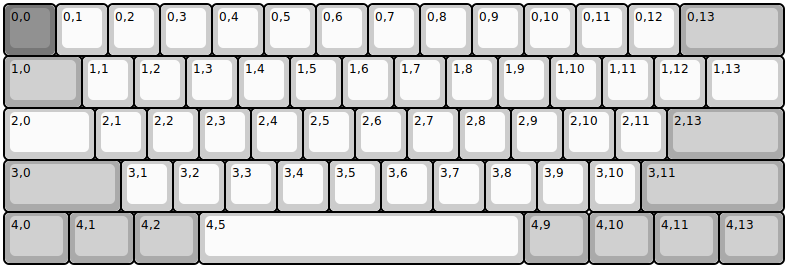
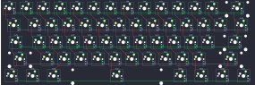
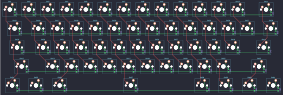

## dztech/dz60rgb_ansi/dz60rgb_ansi_v1

[layout](dz60rgb_ansi_v1-kle.json) - [PCB](dz60rgb_ansi_v1.kicad_pcb)

{:loading="lazy"}

[Open in keyboard-layout-editor](http://www.keyboard-layout-editor.com/##@@_c=#777777;&=0,0&_c=#cccccc;&=0,1&=0,2&=0,3&=0,4&=0,5&=0,6&=0,7&=0,8&=0,9&=0,10&=0,11&=0,12&_c=#aaaaaa&w:2;&=0,13;&@_w:1.5;&=1,0&_c=#cccccc;&=1,1&=1,2&=1,3&=1,4&=1,5&=1,6&=1,7&=1,8&=1,9&=1,10&=1,11&=1,12&_w:1.5;&=1,13;&@_w:1.75;&=2,0&=2,1&=2,2&=2,3&=2,4&=2,5&=2,6&=2,7&=2,8&=2,9&=2,10&=2,11&_c=#aaaaaa&w:2.25;&=2,13;&@_w:2.25;&=3,0&_c=#cccccc;&=3,1&=3,2&=3,3&=3,4&=3,5&=3,6&=3,7&=3,8&=3,9&=3,10&_c=#aaaaaa&w:2.75;&=3,11;&@_w:1.25;&=4,0&_w:1.25;&=4,1&_w:1.25;&=4,2&_c=#cccccc&w:6.25;&=4,5&_c=#aaaaaa&w:1.25;&=4,9&_w:1.25;&=4,10&_w:1.25;&=4,11&_w:1.25;&=4,13)

{:loading="lazy"}

## dztech/dz60rgb_ansi/dz60rgb_ansi_v2

[layout](dz60rgb_ansi_v2-kle.json) - [PCB](dz60rgb_ansi_v2.kicad_pcb)

{:loading="lazy"}

[Open in keyboard-layout-editor](http://www.keyboard-layout-editor.com/##@@_c=#777777;&=0,0&_c=#cccccc;&=0,1&=0,2&=0,3&=0,4&=0,5&=0,6&=0,7&=0,8&=0,9&=0,10&=0,11&=0,12&_c=#aaaaaa&w:2;&=0,13;&@_w:1.5;&=1,0&_c=#cccccc;&=1,1&=1,2&=1,3&=1,4&=1,5&=1,6&=1,7&=1,8&=1,9&=1,10&=1,11&=1,12&_w:1.5;&=1,13;&@_w:1.75;&=2,0&=2,1&=2,2&=2,3&=2,4&=2,5&=2,6&=2,7&=2,8&=2,9&=2,10&=2,11&_c=#aaaaaa&w:2.25;&=2,13;&@_w:2.25;&=3,0&_c=#cccccc;&=3,1&=3,2&=3,3&=3,4&=3,5&=3,6&=3,7&=3,8&=3,9&=3,10&_c=#aaaaaa&w:2.75;&=3,11;&@_w:1.25;&=4,0&_w:1.25;&=4,1&_w:1.25;&=4,2&_c=#cccccc&w:6.25;&=4,5&_c=#aaaaaa&w:1.25;&=4,9&_w:1.25;&=4,10&_w:1.25;&=4,11&_w:1.25;&=4,13)

{:loading="lazy"}

