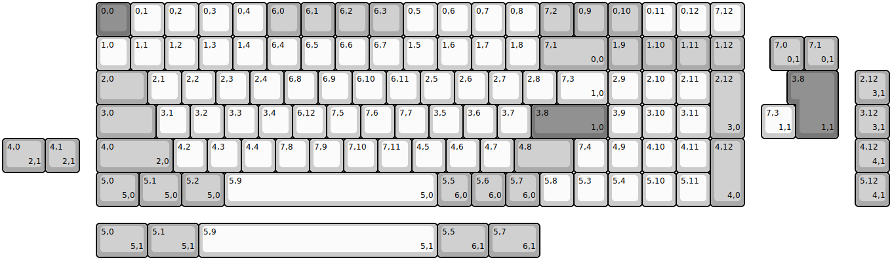
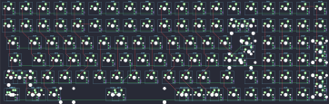

## dztech/dz96

[layout](dz96-kle.json) - [PCB](dz96.kicad_pcb)

{:loading="lazy"}

[Open in keyboard-layout-editor](http://www.keyboard-layout-editor.com/##@@_x:2.75&c=#777777;&=0,0&_c=#cccccc;&=0,1&=0,2&=0,3&=0,4&_c=#aaaaaa;&=6,0&=6,1&=6,2&=6,3&_c=#cccccc;&=0,5&=0,6&=0,7&=0,8&_c=#aaaaaa;&=7,2&=0,9&=0,10&_c=#cccccc;&=0,11&=0,12&=7,12;&@_x:2.75;&=1,0&=1,1&=1,2&=1,3&=1,4&=6,4&=6,5&=6,6&=6,7&=1,5&=1,6&=1,7&=1,8&_c=#aaaaaa&w:2;&=7,1%0A%0A%0A0,0&=1,9&=1,10&=1,11&=1,12;&@_x:2.75&w:1.5;&=2,0&_c=#cccccc;&=2,1&=2,2&=2,3&=2,4&=6,8&=6,9&=6,10&=6,11&=2,5&=2,6&=2,7&=2,8&_w:1.5;&=7,3%0A%0A%0A1,0&=2,9&=2,10&=2,11&_c=#aaaaaa&h:2;&=2,12%0A%0A%0A3,0;&@_x:2.75&w:1.75;&=3,0&_c=#cccccc;&=3,1&=3,2&=3,3&=3,4&=6,12&=7,5&=7,6&=7,7&=3,5&=3,6&=3,7&_c=#777777&w:2.25;&=3,8%0A%0A%0A1,0&_c=#cccccc;&=3,9&=3,10&=3,11;&@_x:2.75&c=#aaaaaa&w:2.25;&=4,0%0A%0A%0A2,0&_c=#cccccc;&=4,2&=4,3&=4,4&=7,8&=7,9&=7,10&=7,11&=4,5&=4,6&=4,7&_c=#aaaaaa&w:1.75;&=4,8&_c=#cccccc;&=7,4&=4,9&=4,10&=4,11&_c=#aaaaaa&h:2;&=4,12%0A%0A%0A4,0;&@_x:2.75&w:1.25;&=5,0%0A%0A%0A5,0&_w:1.25;&=5,1%0A%0A%0A5,0&_w:1.25;&=5,2%0A%0A%0A5,0&_c=#cccccc&w:6.25;&=5,9%0A%0A%0A5,0&_c=#aaaaaa;&=5,5%0A%0A%0A6,0&=5,6%0A%0A%0A6,0&=5,7%0A%0A%0A6,0&_c=#cccccc;&=5,8&=5,3&=5,4&=5,10&=5,11;&@_x:22.5&y:-5&c=#aaaaaa;&=7,0%0A%0A%0A0,1&=7,1%0A%0A%0A0,1;&@_x:23.25&c=#777777&w:1.25&h:2&w2:1.5&h2:1&x2:-0.25;&=3,8%0A%0A%0A1,1&_x:0.5&c=#aaaaaa;&=2,12%0A%0A%0A3,1;&@_x:22.25&c=#cccccc;&=7,3%0A%0A%0A1,1&_x:1.75&c=#aaaaaa;&=3,12%0A%0A%0A3,1;&@_w:1.25;&=4,0%0A%0A%0A2,1&=4,1%0A%0A%0A2,1&_x:22.75;&=4,12%0A%0A%0A4,1;&@_x:25.0;&=5,12%0A%0A%0A4,1;&@_x:2.75&y:0.5&w:1.5;&=5,0%0A%0A%0A5,1&_w:1.5;&=5,1%0A%0A%0A5,1&_c=#cccccc&w:7;&=5,9%0A%0A%0A5,1&_c=#aaaaaa&w:1.5;&=5,5%0A%0A%0A6,1&_w:1.5;&=5,7%0A%0A%0A6,1)

{:loading="lazy"}

