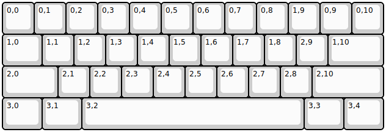

## edc40/edc40

[layout](edc40-kle.json) - [PCB](edc40.kicad_pcb)

{:loading="lazy"}

[Open in keyboard-layout-editor](http://www.keyboard-layout-editor.com/##@@=0,0&=0,1&=0,2&=0,3&=0,4&=0,5&=0,6&=0,7&=0,8&=1,9&=0,9&=0,10;&@_w:1.25;&=1,0&=1,1&=1,2&=1,3&=1,4&=1,5&=1,6&=1,7&=1,8&=2,9&_w:1.75;&=1,10;&@_w:1.75;&=2,0&=2,1&=2,2&=2,3&=2,4&=2,5&=2,6&=2,7&=2,8&_w:2.25;&=2,10;&@_w:1.25;&=3,0&_w:1.25;&=3,1&_w:7;&=3,2&_w:1.25;&=3,3&_w:1.25;&=3,4)

{:loading="lazy"}

