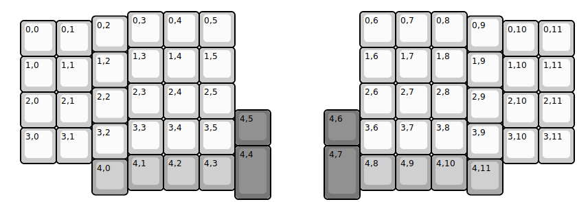
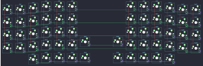

## elagil/polilla

[layout](polilla-kle.json) - [PCB](polilla.kicad_pcb)

{:loading="lazy"}

[Open in keyboard-layout-editor](http://www.keyboard-layout-editor.com/##@@_x:3.5&y:0.25;&=0,3&=0,4&=0,5&_x:3.5;&=0,6&=0,7&=0,8;&@_x:2.5&y:-0.875;&=0,2&_x:9.5;&=0,9;&@_x:0.5&y:-0.875;&=0,0&=0,1&_x:11.5;&=0,10&=0,11;&@_x:3.5&y:-0.25;&=1,3&=1,4&=1,5&_x:3.5;&=1,6&=1,7&=1,8;&@_x:2.5&y:-0.875;&=1,2&_x:9.5;&=1,9;&@_x:0.5&y:-0.875;&=1,0&=1,1&_x:11.5;&=1,10&=1,11;&@_x:3.5&y:-0.25;&=2,3&=2,4&=2,5&_x:3.5;&=2,6&=2,7&=2,8;&@_x:2.5&y:-0.875;&=2,2&_x:9.5;&=2,9;&@_x:0.5&y:-0.875;&=2,0&=2,1&_x:11.5;&=2,10&=2,11;&@_x:3.5&y:-0.25;&=3,3&=3,4&=3,5&_x:3.5;&=3,6&=3,7&=3,8;&@_x:2.5&y:-0.875;&=3,2&_x:9.5;&=3,9;&@_x:0.5&y:-0.875;&=3,0&=3,1&_x:11.5;&=3,10&=3,11;&@_rx:6.5&ry:4.5&y:-1.5&c=#777777;&=4,5;&@_h:1.5;&=4,4;&@_x:-3.0&y:-0.75&c=#aaaaaa;&=4,1&=4,2&=4,3;&@_x:-4.0&y:-0.875;&=4,0;&@_rx:10&x:-1&y:-1.5&c=#777777;&=4,6;&@_x:-1&h:1.5;&=4,7;&@_y:-0.75&c=#aaaaaa;&=4,8&=4,9&=4,10;&@_x:3&y:-0.875;&=4,11)

{:loading="lazy"}

