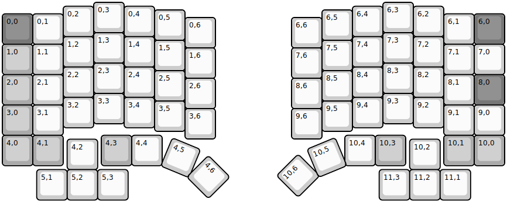
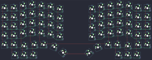

## ergoarrows/ergoarrows

[layout](ergoarrows-kle.json) - [PCB](ergoarrows.kicad_pcb)

{:loading="lazy"}

[Open in keyboard-layout-editor](http://www.keyboard-layout-editor.com/##@@_x:3;&=0,3&_x:8.5;&=6,3;&@_x:2&y:-0.87;&=0,2&_x:1;&=0,4&_x:6.5;&=6,4&_x:1.0;&=6,2;&@_x:5&y:-0.88;&=0,5&_x:4.5;&=6,5;&@_y:-0.87&c=#777777;&=0,0&_c=#cccccc;&=0,1&_x:12.5;&=6,1&_c=#777777;&=6,0;&@_x:6&y:-0.88&c=#cccccc;&=0,6&_x:2.5;&=6,6;&@_x:3&y:-0.5;&=1,3&_x:8.5;&=7,3;&@_x:2&y:-0.87;&=1,2&_x:1;&=1,4&_x:6.5;&=7,4&_x:1.0;&=7,2;&@_x:5&y:-0.88;&=1,5&_x:4.5;&=7,5;&@_y:-0.87&c=#aaaaaa;&=1,0&_c=#cccccc;&=1,1&_x:12.5;&=7,1&=7,0;&@_x:6&y:-0.88;&=1,6&_x:2.5;&=7,6;&@_x:3&y:-0.5;&=2,3&_x:8.5;&=8,3;&@_x:2&y:-0.87;&=2,2&_x:1;&=2,4&_x:6.5;&=8,4&_x:1.0;&=8,2;&@_x:5&y:-0.88;&=2,5&_x:4.5;&=8,5;&@_y:-0.87&c=#aaaaaa;&=2,0&_c=#cccccc;&=2,1&_x:12.5;&=8,1&_c=#777777;&=8,0;&@_x:6&y:-0.88&c=#cccccc;&=2,6&_x:2.5;&=8,6;&@_x:3&y:-0.5;&=3,3&_x:8.5;&=9,3;&@_x:2&y:-0.87;&=3,2&_x:1;&=3,4&_x:6.5;&=9,4&_x:1.0;&=9,2;&@_x:5&y:-0.88;&=3,5&_x:4.5;&=9,5;&@_y:-0.87&c=#aaaaaa;&=3,0&_c=#cccccc;&=3,1&_x:12.5;&=9,1&=9,0;&@_x:6&y:-0.88;&=3,6&_x:2.5;&=9,6;&@_y:-0.12&c=#aaaaaa;&=4,0&=4,1&_x:1.25;&=4,3&_c=#cccccc;&=4,4&_x:6.0;&=10,4&_c=#aaaaaa;&=10,3&_x:1.25;&=10,1&=10,0;&@_x:2.13&y:-0.87&c=#cccccc;&=4,2&_x:10.25;&=10,2;&@_x:1.13;&=5,1&=5,2&=5,3&_x:8.25;&=11,3&=11,2&=11,1;&@_r:22.5&rx:5.65&ry:3.75&x:0.24&y:0.65;&=4,5;&@_r:45&x:1.74&y:-1.6;&=4,6;&@_r:-45&rx:11&x:-2.87&y:0.01;&=10,6;&@_r:-22.5&x:-1.37&y:-0.36;&=10,5)

{:loading="lazy"}

