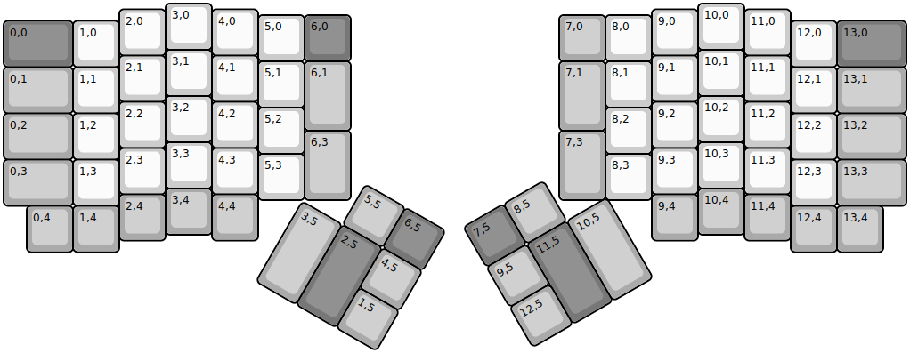
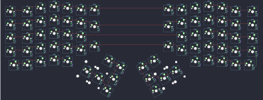

## ergodox_ez/ergodox_ez

[layout](ergodox_ez-kle.json) - [PCB](ergodox_ez.kicad_pcb)

{:loading="lazy"}

[Open in keyboard-layout-editor](http://www.keyboard-layout-editor.com/##@@_x:3.5;&=3,0&_x:10.5;&=10,0;&@_x:2.5&y:-0.875;&=2,0&_x:1.0;&=4,0&_x:8.5;&=9,0&_x:1.0;&=11,0;&@_x:5.5&y:-0.875;&=5,0&_c=#777777;&=6,0&_x:4.5&c=#aaaaaa;&=7,0&_c=#cccccc;&=8,0;&@_y:-0.875&c=#777777&w:1.5;&=0,0&_c=#cccccc;&=1,0&_x:14.5;&=12,0&_c=#777777&w:1.5;&=13,0;&@_x:3.5&y:-0.375&c=#cccccc;&=3,1&_x:10.5;&=10,1;&@_x:2.5&y:-0.875;&=2,1&_x:1.0;&=4,1&_x:8.5;&=9,1&_x:1.0;&=11,1;&@_x:5.5&y:-0.875;&=5,1&_c=#aaaaaa&h:1.5;&=6,1&_x:4.5&h:1.5;&=7,1&_c=#cccccc;&=8,1;&@_y:-0.875&c=#aaaaaa&w:1.5;&=0,1&_c=#cccccc;&=1,1&_x:14.5;&=12,1&_c=#aaaaaa&w:1.5;&=13,1;&@_x:3.5&y:-0.375&c=#cccccc;&=3,2&_x:10.5;&=10,2;&@_x:2.5&y:-0.875;&=2,2&_x:1.0;&=4,2&_x:8.5;&=9,2&_x:1.0;&=11,2;&@_x:5.5&y:-0.875;&=5,2&_x:6.5;&=8,2;&@_y:-0.875&c=#aaaaaa&w:1.5;&=0,2&_c=#cccccc;&=1,2&_x:14.5;&=12,2&_c=#aaaaaa&w:1.5;&=13,2;&@_x:6.5&y:-0.625&h:1.5;&=6,3&_x:4.5&h:1.5;&=7,3;&@_x:3.5&y:-0.75&c=#cccccc;&=3,3&_x:10.5;&=10,3;&@_x:2.5&y:-0.875;&=2,3&_x:1.0;&=4,3&_x:8.5;&=9,3&_x:1.0;&=11,3;&@_x:5.5&y:-0.875;&=5,3&_x:6.5;&=8,3;&@_y:-0.875&c=#aaaaaa&w:1.5;&=0,3&_c=#cccccc;&=1,3&_x:14.5;&=12,3&_c=#aaaaaa&w:1.5;&=13,3;&@_x:3.5&y:-0.375;&=3,4&_x:10.5;&=10,4;&@_x:2.5&y:-0.875;&=2,4&_x:1.0;&=4,4&_x:8.5;&=9,4&_x:1.0;&=11,4;&@_x:0.5&y:-0.75;&=0,4&=1,4&_x:14.5;&=12,4&=13,4;&@_r:30&rx:6.5&ry:4.25&x:1.0&y:-1.0;&=5,5&_c=#777777;&=6,5;&@_c=#aaaaaa&h:2;&=3,5&_c=#777777&h:2;&=2,5&_c=#aaaaaa;&=4,5;&@_x:2.0;&=1,5;&@_r:-30&rx:13&x:-3&y:-1.0&c=#777777;&=7,5&_c=#aaaaaa;&=8,5;&@_x:-3;&=9,5&_c=#777777&h:2;&=11,5&_c=#aaaaaa&h:2;&=10,5;&@_x:-3;&=12,5)

{:loading="lazy"}

