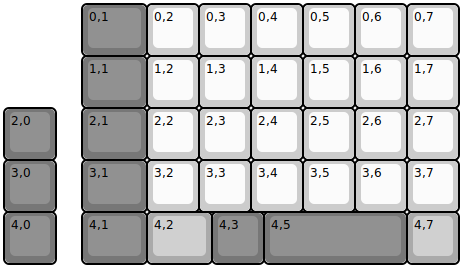
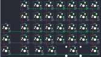

## eternal_keypad/eternal_keypad

[layout](eternal_keypad-kle.json) - [PCB](eternal_keypad.kicad_pcb)

{:loading="lazy"}

[Open in keyboard-layout-editor](http://www.keyboard-layout-editor.com/##@@_x:1.5&c=#777777&w:1.25;&=0,1&_c=#cccccc;&=0,2&=0,3&=0,4&=0,5&=0,6&=0,7;&@_x:1.5&c=#777777&w:1.25;&=1,1&_c=#cccccc;&=1,2&=1,3&=1,4&=1,5&=1,6&=1,7;&@_c=#777777;&=2,0&_x:0.5&w:1.25;&=2,1&_c=#cccccc;&=2,2&=2,3&=2,4&=2,5&=2,6&=2,7;&@_c=#777777;&=3,0&_x:0.5&w:1.25;&=3,1&_c=#cccccc;&=3,2&=3,3&=3,4&=3,5&=3,6&=3,7;&@_c=#777777;&=4,0&_x:0.5&w:1.25;&=4,1&_c=#aaaaaa&w:1.25;&=4,2&_c=#777777;&=4,3&_w:2.75;&=4,5&_c=#aaaaaa;&=4,7)

{:loading="lazy"}

