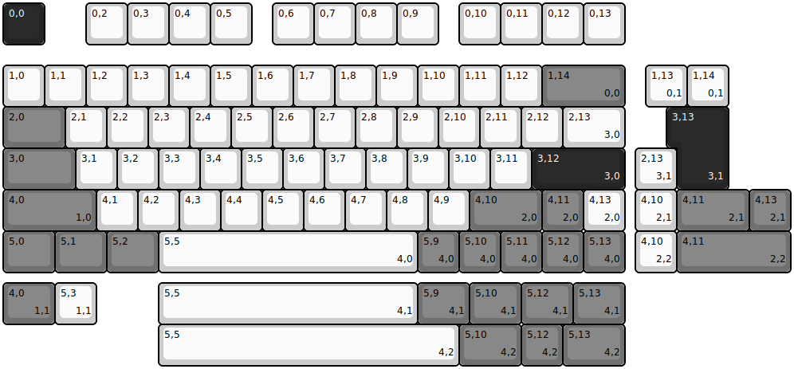
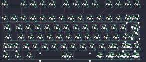

## eve/meteor

[layout](meteor-kle.json) - [PCB](meteor.kicad_pcb)

{:loading="lazy"}

[Open in keyboard-layout-editor](http://www.keyboard-layout-editor.com/##@@_c=#242424&t=#ffffff;&=0,0&_x:1&c=#cccccc&t=#000000;&=0,2&=0,3&=0,4&=0,5&_x:0.5;&=0,6&=0,7&=0,8&=0,9&_x:0.5;&=0,10&=0,11&=0,12&=0,13;&@_y:0.5;&=1,0&=1,1&=1,2&=1,3&=1,4&=1,5&=1,6&=1,7&=1,8&=1,9&=1,10&=1,11&=1,12&_c=#707070&w:2;&=1,14%0A%0A%0A0,0;&@_w:1.5;&=2,0&_c=#cccccc;&=2,1&=2,2&=2,3&=2,4&=2,5&=2,6&=2,7&=2,8&=2,9&=2,10&=2,11&=2,12&_w:1.5;&=2,13%0A%0A%0A3,0;&@_c=#707070&w:1.75;&=3,0&_c=#cccccc;&=3,1&=3,2&=3,3&=3,4&=3,5&=3,6&=3,7&=3,8&=3,9&=3,10&=3,11&_c=#242424&t=#ffffff&w:2.25;&=3,12%0A%0A%0A3,0;&@_c=#707070&t=#000000&w:2.25;&=4,0%0A%0A%0A1,0&_c=#cccccc;&=4,1&=4,2&=4,3&=4,4&=4,5&=4,6&=4,7&=4,8&=4,9&_c=#707070&w:1.75;&=4,10%0A%0A%0A2,0&=4,11%0A%0A%0A2,0&_c=#cccccc;&=4,13%0A%0A%0A2,0;&@_c=#707070&w:1.25;&=5,0&_w:1.25;&=5,1&_w:1.25;&=5,2&_c=#cccccc&w:6.25;&=5,5%0A%0A%0A4,0&_c=#707070;&=5,9%0A%0A%0A4,0&=5,10%0A%0A%0A4,0&=5,11%0A%0A%0A4,0&=5,12%0A%0A%0A4,0&=5,13%0A%0A%0A4,0;&@_x:15.5&y:-5.0&c=#cccccc;&=1,13%0A%0A%0A0,1&=1,14%0A%0A%0A0,1;&@_x:16.25&c=#242424&t=#ffffff&w:1.25&h:2&w2:1.5&h2:1&x2:-0.25;&=3,13%0A%0A%0A3,1;&@_x:15.25&c=#cccccc&t=#000000;&=2,13%0A%0A%0A3,1;&@_x:15.25;&=4,10%0A%0A%0A2,1&_c=#707070&w:1.75;&=4,11%0A%0A%0A2,1&=4,13%0A%0A%0A2,1;&@_x:15.25&c=#cccccc;&=4,10%0A%0A%0A2,2&_c=#707070&w:2.75;&=4,11%0A%0A%0A2,2;&@_y:0.25&w:1.25;&=4,0%0A%0A%0A1,1&_c=#cccccc;&=5,3%0A%0A%0A1,1&_x:1.5&w:6.25;&=5,5%0A%0A%0A4,1&_c=#707070&w:1.25;&=5,9%0A%0A%0A4,1&_w:1.25;&=5,10%0A%0A%0A4,1&_w:1.25;&=5,12%0A%0A%0A4,1&_w:1.25;&=5,13%0A%0A%0A4,1;&@_x:3.75&c=#cccccc&w:7.25;&=5,5%0A%0A%0A4,2&_c=#707070&w:1.5;&=5,10%0A%0A%0A4,2&=5,12%0A%0A%0A4,2&_w:1.5;&=5,13%0A%0A%0A4,2)

{:loading="lazy"}

