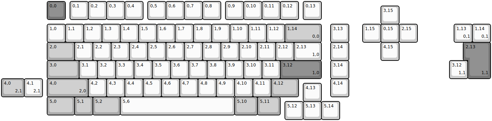
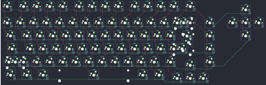

## evolv/evolv_ce

[layout](evolv_ce-kle.json) - [PCB](evolv_ce.kicad_pcb)

{:loading="lazy"}

[Open in keyboard-layout-editor](http://www.keyboard-layout-editor.com/##@@_x:2.5&c=#777777;&=0,0&_x:0.25&c=#cccccc;&=0,1&=0,2&=0,3&=0,4&_x:0.25;&=0,5&=0,6&=0,7&=0,8&_x:0.25;&=0,9&=0,10&=0,11&=0,12&_x:0.25;&=0,13;&@_x:20.75&y:-0.75;&=3,15;&@_x:2.5;&=1,0&=1,1&=1,2&=1,3&=1,4&=1,5&=1,6&=1,7&=1,8&=1,9&=1,10&=1,11&=1,12&_c=#aaaaaa&w:2;&=1,14%0A%0A%0A0,0&_x:0.5&c=#cccccc;&=3,13&_x:0.75;&=1,15&=0,15&=2,15;&@_x:2.5&c=#aaaaaa&w:1.5;&=2,0&_c=#cccccc;&=2,1&=2,2&=2,3&=2,4&=2,5&=2,6&=2,7&=2,8&=2,9&=2,10&=2,11&=2,12&_w:1.5;&=2,13%0A%0A%0A1,0&_x:0.5;&=2,14&_x:1.75;&=4,15;&@_x:2.5&c=#aaaaaa&w:1.75;&=3,0&_c=#cccccc;&=3,1&=3,2&=3,3&=3,4&=3,5&=3,6&=3,7&=3,8&=3,9&=3,10&=3,11&_c=#777777&w:2.25;&=3,12%0A%0A%0A1,0&_x:0.5&c=#cccccc;&=3,14;&@_x:2.5&c=#aaaaaa&w:2.25;&=4,0%0A%0A%0A2,0&_c=#cccccc;&=4,2&=4,3&=4,4&=4,5&=4,6&=4,7&=4,8&=4,9&=4,10&=4,11&_c=#aaaaaa&w:1.5;&=4,12&_x:1.75&c=#cccccc;&=4,14;&@_x:16.5&y:-0.75;&=4,13;&@_x:2.5&y:-0.25&c=#aaaaaa&w:1.5;&=5,0&=5,1&_w:1.5;&=5,2&_c=#cccccc&w:6.25;&=5,6&_c=#aaaaaa&w:1.25;&=5,10&_w:1.25;&=5,11;&@_x:15.5&y:-0.75&c=#cccccc;&=5,12&=5,13&=5,14;&@_x:24.75&y:-5.25;&=1,13%0A%0A%0A0,1&=1,14%0A%0A%0A0,1;&@_x:25.5&c=#777777&w:1.25&h:2&w2:1.5&h2:1&x2:-0.25;&=2,13%0A%0A%0A1,1;&@_x:24.5&c=#cccccc;&=3,12%0A%0A%0A1,1;&@_c=#aaaaaa&w:1.25;&=4,0%0A%0A%0A2,1&_c=#cccccc;&=4,1%0A%0A%0A2,1)

{:loading="lazy"}

